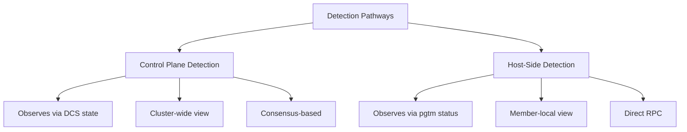
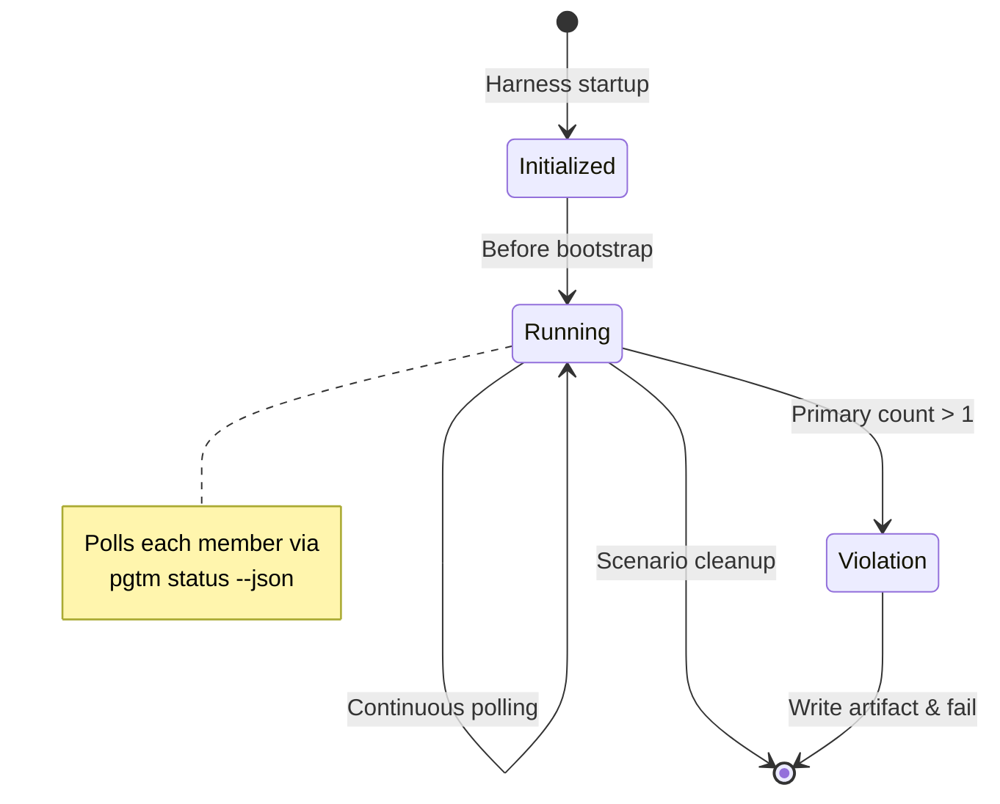
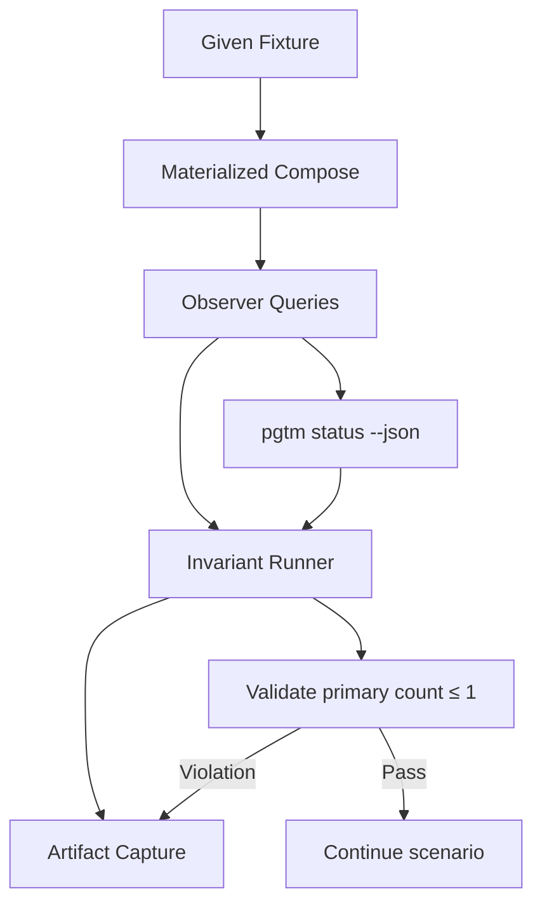

# Failure Modes and Recovery Behavior

PostgreSQL high availability clusters must survive component failures without violating safety guarantees. Understanding failure modes helps operators choose recovery actions and validate system behavior under stress.

## Detection Pathways

The system uses two distinct detection pathways that operate at different observability levels:



**Control Plane Detection**  
The control plane observes member state through the distributed consensus store. Process death detection occurs via session expiration in the DCS. Network partitions are detected through failed heartbeats and connectivity checks between DCS nodes. DCS health itself is monitored via internal consensus protocols and node liveness checks.

**Host-Side Detection**  
Host-side tools query members directly without traversing the cluster network. The `pgtm status --json` command returns per-member state including PostgreSQL role and identity information. This pathway functions even when a member cannot reach the DCS.

The HA acceptance harness relies entirely on host-side detection to enforce safety invariants, making it a useful model for understanding direct observation.

## Safety Invariants

The most critical safety property is the primary count invariant: at most one member may claim the PostgreSQL primary role at any moment. Violations indicate split-brain and risk data corruption.

### Perpetual Invariant Runner

The HA test harness implements a **perpetual primary-count invariant runner** that continuously validates this property across all scenarios. This runner:

- Polls every member individually via `pgtm status --json` through a host-side observer
- Examines only the self-reported `NodeState.pg` field (Primary, Replica, or Unknown)
- Treats command failure as absence of self-report for that member
- Fails the scenario immediately if primary count exceeds one
- Writes a structured artifact at `artifacts/primary-count-invariant-violation.json` containing the violating sample



The runner starts before cluster bootstrap and stops during scenario cleanup, ensuring it validates the entire scenario lifetime. The artifact includes:

```json
{
  "observed_at_ms": 123456789,
  "allowed_primary_counts": [0, 1],
  "primary_count": 2,
  "members": [
    {"member": "node-a", "self_report": {"kind": "primary"}},
    {"member": "node-b", "self_report": {"kind": "primary"}}
  ]
}
```

This design removes the need for feature-local dual-primary assertions or timeline-based bookkeeping, centralizing safety validation in a single always-on component.

### Production vs. Test Behavior

The perpetual runner validates test scenarios. It is a host-side HA test harness safety check, not production runtime behavior. Production systems rely on control-plane reconciliation loops and built-in PostgreSQL safety mechanisms to prevent split-brain situations.

## Recovery Behavior

**Automatic Restart**  
When PostgreSQL exits unexpectedly, Patroni detects the process termination via DCS session expiration and local health checks. It automatically restarts the postmaster using the configured `pg_ctl` command. Restart attempts respect backoff policies to prevent rapid respawn loops. The recovery process replays WAL from available sources before accepting connections.

**Automatic Failover**  
Failover triggers when the current primary becomes unhealthy, detected through DCS session loss combined with direct PostgreSQL connectivity failures. The HA decision engine selects the most eligible replica based on:
- Synchronized replication state (`synchronous_standby_names`)
- Highest LSN position to minimize data loss
- Reachability and health status from DCS perspective
- Configuration-defined priority scores

The engine promotes the selected replica by creating a `failover` key in the DCS, which triggers the replica to run `pg_ctl promote`. The old primary is demoted via a restart in recovery mode if it rejoins.

**Operator Tooling**  
The `pgtm` CLI provides `status`, `switchover request`, and other commands for manual intervention. Role-based authentication and TLS verify-full mode protect these operations.

**Switchover Requirements**  
Switchover operations require a healthy primary, at least one synchronized replica, and quiesced writes. The system confirms replica readiness by checking `pg_stat_replication` for active sync standby connections and replay lag below configured thresholds before promoting a replica and demoting the current primary.

## Test Harness Validation

The acceptance suite exercises failure modes in containerized topologies (three-node clusters with shared or per-node DCS). Key features:

- **Fault Injection**: Network partitions, DCS connectivity loss, and process kills
- **Continuous Observation**: The invariant runner plus timeline snapshots capture state evolution
- **Artifact Capture**: Logs, compose state, and per-member status are persisted on failure

The perpetual invariant runner ensures every scenario enforces the primary-count safety property without burdening feature text with repeated assertions.


