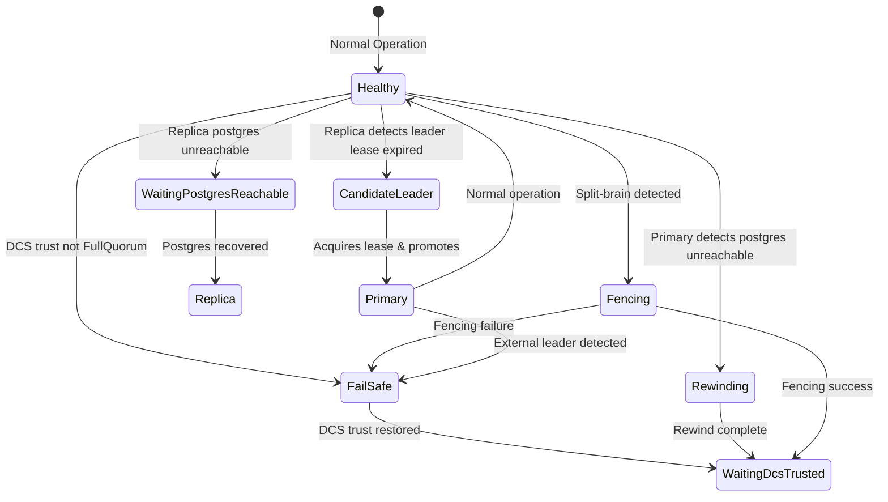

# Failure Modes and Recovery Behavior

This page explains how pgtuskmaster responds to component failures. It covers the system's trust model, how failures are categorized, and the reasoning behind recovery strategies. Understanding these concepts helps operators predict system behavior during outages and make informed decisions about deployment topology and configuration.

## The DCS Trust Model

pgtuskmaster's behavior depends heavily on its view of cluster state, which comes from a distributed configuration store (DCS). The system does not treat DCS as either fully reliable or fully unreliable. Instead, it evaluates trust continuously and makes distinct decisions at each trust level.

### Trust Levels

The system uses three discrete trust evaluations:

**FullQuorum**
The DCS is healthy and at least two members have fresh metadata. The system can safely perform leader elections, coordinate switchovers, and enforce split-brain prevention.

**FailSafe**
The DCS is accessible but does not meet full consensus requirements. This occurs when the local member record is stale or fewer than two members appear fresh in a multi-member view. In this state the system limits its activity to prevent data corruption.

**NotTrusted**
The DCS is unreachable or otherwise unhealthy. All trust-dependent operations are suspended.

### Why Trust Degrades

Trust degrades to protect against split-brain scenarios. If a node cannot verify that its view of the cluster is current, acting on stale information could cause it to promote itself while another primary is still active. The system prefers to pause or enter a safe mode rather than risk data divergence.

Trust evaluation follows a specific sequence:

```mermaid
graph TD
    A[Start Trust Evaluation] --> B{Is etcd healthy?}
    B -->|No| C[Trust = NotTrusted]
    B -->|Yes| D{Is local member record fresh?<br/>(< ha.lease_ttl_ms)}
    D -->|No| E[Trust = FailSafe]
    D -->|Yes| F{Is cluster > 1 node?}
    F -->|No| G[Trust = FullQuorum]
    F -->|Yes| H{≥2 members have fresh records?}
    H -->|No| E
    H -->|Yes| G
```

1. If etcd itself reports unhealthy, trust becomes `NotTrusted`
2. If the local member record is missing or older than `ha.lease_ttl_ms`, trust becomes `FailSafe`
3. In clusters larger than one node, if fewer than two members have fresh records, trust becomes `FailSafe`
4. Only when all checks pass does trust become `FullQuorum`

This design reflects a key principle: membership metadata freshness acts as a heartbeat. A node that stops updating its record is treated as failed, even if the DCS remains healthy.

Leader liveness is lease-backed rather than inferred from stale metadata. The etcd store attaches `/{scope}/leader` to an etcd lease derived from `ha.lease_ttl_ms`. If the owner releases leadership, it revokes its own lease. If the owner dies hard, keepalive stops and etcd deletes the leader key automatically when the lease expires. The watch-fed DCS cache then removes the leader record, allowing a healthy majority to continue election without manual DCS cleanup.

## PostgreSQL Reachability as a Distinct Axis

While DCS trust affects coordination safety, PostgreSQL reachability determines what local actions are possible. The system treats these as orthogonal concerns. A node can have `FullQuorum` trust while its local PostgreSQL is unreachable, or vice versa.

PostgreSQL reachability is binary in decision logic: either `SqlStatus::Healthy` or not. `Unknown` and `Unreachable` states both block replication and promotion actions. This binary approach simplifies state management but has important implications for recovery behavior.

## Failure Classification and Phase Transitions

When failures occur, the system transitions through specific HA phases. Each phase represents a coherent state where the system waits for a condition or performs a bounded set of actions.



### Initial Failure Response

The decision logic in `src/ha/decide.rs` prioritizes safety over availability. If DCS trust is not `FullQuorum`, the system immediately routes to `FailSafe` phase. The only exception is when the local PostgreSQL is a confirmed healthy primary, in which case it emits `EnterFailSafe` to ensure the leader lease is released.

This behavior ensures that network partitions or DCS outages do not create split-brain scenarios. By entering `FailSafe`, nodes avoid taking coordinated actions until they can verify cluster state.

### Primary Failure Handling

When a primary node fails, the recovery sequence depends on whether the failure is detected internally (postgres stops) or externally (DCS marks it stale).

**Internal detection (postgres becomes unreachable):**
If the node holds the leader lease, it releases its lease with reason `PostgresUnreachable` and transitions to `Rewinding`. This signals other nodes that the primary is stepping down intentionally.

**External detection (other nodes observe failure):**
When replicas observe that the old leader lease has expired and no active leader remains in DCS, they follow standard leader election. A replica transitions from `Replica` to `CandidateLeader`, attempts to acquire the leader lease, and promotes to primary if successful.

The `Rewinding` phase is intentional: it provides a dedicated state where the node reconciles its potentially diverged state before rejoining as a replica. This prevents a former primary from immediately following a new leader without first rewinding or re-cloning.

### Replica Failure Handling

Replica failure follows a simpler path. If PostgreSQL becomes unreachable, the replica enters `WaitingPostgresReachable` and periodically attempts to start it. The allowed source set supports that waiting behavior and the `WaitForPostgres` decision, but not a stronger claim about a separate timeout-based escalation policy for prolonged outages.

## Recovery Mechanisms

The system supports three recovery strategies, each with specific use cases and safety implications.

### Rewind Recovery

Rewind uses `pg_rewind` to reconcile a diverged former primary with its new upstream. This is efficient because it only transfers changed blocks. The decision engine emits `StartRewind` when a timeline divergence is detected.

The engine detects divergence by comparing timelines: if the local timeline does not match the leader's timeline, rewind is required. This check prevents unnecessary rewind operations when timelines are already consistent.

### Base Backup Recovery

When rewind is not possible or fails, the system falls back to base backup. This performs a full physical copy from the primary. The decision engine emits `StartBaseBackup` after rewind failure or when no local timeline exists.

Base backup is slower and more resource-intensive than rewind.

### Bootstrap Recovery

Bootstrap creates a new cluster from scratch. This is used only during initial cluster formation, not for recovery. The distinction is important: bootstrap assumes an empty data directory, while recovery assumes a potentially corrupted or diverged existing directory.

## Safety Mechanisms and Split-Brain Prevention

The system prevents split-brain through a combination of leader leases, fencing, and explicit phase constraints.

### Leader Leases

A leader lease is a DCS entry that a primary must hold to be considered authoritative. Acquiring the lease requires a DCS write that succeeds only if no other node holds it. Releasing the lease is a deliberate action that triggers specific downstream behaviors.

In the etcd-backed store, the leader key is attached to an etcd lease. When a primary detects it should step down (switchover or external leader detection), it revokes its own lease before demoting. If the process dies hard, the missing keepalive causes etcd to expire the lease and delete the key automatically. This ensures that no node can rely on a blind delete of another node's leader key.

### Fencing

Fencing is the process of forcibly stopping a misbehaving primary. The system enters `Fencing` phase when it detects an apparent split-brain: local PostgreSQL is primary but DCS shows a different leader.

The fencing process runs as an independent job. Success transitions back to `WaitingDcsTrusted` with a lease release. Failure transitions to `FailSafe`, halting all further action. This conservative approach reflects that fencing failure indicates deeper infrastructure problems.

### The HA Invariant Runners

The HA test harness runs two perpetual invariant runners for every HA scenario. These are first-class safety checks, not optional diagnostics.

#### Primary-Count Invariant Runner

This runner continuously samples all members individually through the host-side `pgtm status --json` observation surface. It counts only each node's local self-report from `NodeState.pg`:

- `PgInfoState::Primary` counts as primary
- `PgInfoState::Replica` and `PgInfoState::Unknown` count as not-primary
- Command failure for a member counts as absence of self-report

The allowed self-reported primary counts are `{0, 1}`. The scenario fails immediately when the sampled primary count is outside that set, and the violating sample is persisted to `artifacts/primary-count-invariant-violation.json`.

This replaced feature-local dual-primary assertions and transition-history bookkeeping with a host-side validation path that demonstrates split-brain prevention is a first-class design goal.

#### Write-Convergence Invariant Runner

This runner enforces a stronger guarantee: every write that the cluster accepted as committed must eventually be visible on all nodes. After bootstrap succeeds, it begins probing the cluster in a loop.

Before issuing any writes, it waits until the invariant table `public.ha_write_convergence_invariant` becomes visible on all members. This ensures the runner does not count writes during the initial bootstrap window.

Each iteration performs two probes:

1. **Accepted-write probe**: Observes the cluster's current authority projection from `NodeState.ha.publication`. Writes only through that authoritative primary's Postgres endpoint. If SQL succeeds, records the write as accepted.

2. **Rejected-write probe**: Round-robins over non-authoritative members. If any non-authoritative target unexpectedly accepts the write, the runner fails immediately.

Accepted writes are tracked until visible on every member. The runner persists:
- `artifacts/write-convergence-invariant-events.jsonl`
- `artifacts/write-convergence-invariant-summary.json`
- `artifacts/write-convergence-invariant-violation.json` on timeout

The harness derives a dedicated convergence window: `TimeoutModel::write_convergence_deadline = failover_deadline + recovery_deadline`. This intentionally exceeds a single poll interval because accepted writes may need both failover and node recovery intervals before converging everywhere.

This runner demonstrates that committed-write propagation is a verified invariant, not an assumed property.

## Fail-Safe Mode

`FailSafe` is the system's panic mode. It is not a recovery state but a holding pattern. Unlike other phases, `FailSafe` does not automatically attempt recovery. It persists until DCS trust is restored, at which point it exits to `WaitingDcsTrusted`.

The rationale is that entering `FailSafe` indicates insufficient information to make safe decisions. Automated recovery would risk exacerbating an unknown failure mode. Human operators must investigate and restore trust conditions.

The system may emit `SignalFailSafe` to local processes.

## Timeout Behavior and Missing Source Support

The source code shows several timeout mechanisms but does not expose operator-configurable retry policies or maximum outage durations before escalation. For example:

- etcd commands have a hard-coded timeout of 2 seconds
- Process jobs have deadlines but the decision engine does not automatically escalate after repeated timeouts
- The HA loop polls at a configured interval but does not implement backoff

Missing source support for specific retry counts and escalation timers means the safest statement is simply that the code exposes timeouts and deadlines, but the provided source set does not prove a richer operator-facing escalation policy.

The source-backed behavior is intentionally conservative: degraded trust routes to `FailSafe`, primary loss can release leadership and move through rewind or base-backup recovery, and fencing exists to handle foreign-leader detection.
