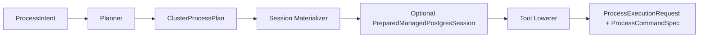
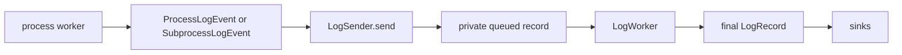

# Process Management and Execution Domain

The process management layer is the execution boundary between the HA reconciler and the operating system. This boundary exists to preserve architectural purity: the HA decision engine focuses exclusively on cluster state and safety invariants, while the process layer translates those decisions into concrete PostgreSQL subprocess work. Neither domain leaks concerns into the other.

## Why This Boundary Exists

The process management boundary solves a tension between high-level orchestration and low-level execution. HA logic must remain pure, reasoning only about quorum, fencing, and switchover coordination. It should not contain code that spawns `postgres`, `pg_rewind`, or `pg_basebackup`. The process layer owns DCS-backed source resolution and validation internally; the intended boundary is that HA no longer owns those details, not that the process domain is ignorant of DCS/member-health facts.


## The Three-Stage Preparation Pipeline

A March 2026 refactor replaced the monolithic worker-owned preparation logic with a three-stage pipeline. The HA reconciler emits a `ProcessIntent`. The worker passes this intent to a `ProcessCluster` facade, which orchestrates preparation through three distinct modules. Each stage has a single responsibility and produces an intermediate artifact that the next stage consumes.



### Stage One: Intent Planning

The `ProcessIntentPlanner` in `src/process/planner.rs` converts a `ProcessIntent` into a `ClusterProcessPlan`. This stage owns DCS trust validation, source member resolution, and replica-source selection. For replica-provisioning paths, the planner reads the latest DCS view and validates that the chosen leader is a healthy primary and not the local member. For managed PostgreSQL starts, the planner derives the desired session shape—primary, detached standby, or replica-follow—based on the intent and observed state.

The planner produces a first-class plan ADT that carries explicit replication source information. For replica starts, the plan includes a `ReplicaFollowPlan` containing a `MandatoryRoleSourceConn` with conninfo, auth, and role. This keeps replication policy inside the process domain instead of scattering it across HA and runtime startup code.

### Stage Two: Session Materialization

The `ManagedPostgresSessionMaterializer` in `src/process/session.rs` handles authoritative managed PostgreSQL runtime-file creation for start flows. Given a `ClusterProcessPlan` and the desired session shape from the planner, the materializer writes managed files like `pgtm.postgresql.conf`, `pgtm.pg_hba.conf`, and `pgtm.pg_ident.conf`, plus managed signal/passfile artifacts into the data directory.

This stage calls `ProcessRuntimePlan::ensure_start_paths()` before writing files, guaranteeing that the data directory, socket directory, and log parent exist with correct permissions. For non-start plans, the materializer returns `None` and does no work.

### Stage Three: Tool Lowering

The `ExternalToolLowerer` in `src/process/tools.rs` converts the plan and optional prepared session into a concrete execution request and command specification. This stage also performs destructive preparation: for bootstrap and basebackup operations, it wipes the data directory contents before constructing the external command. For start-postgres, it uses the prepared session's config file path to build the `pg_ctl` invocation.

The lowerer validates all input paths and endpoint values, ensuring that missing or malformed configuration fails fast with clear attribution. It constructs the final `ProcessExecutionRequest` and `ProcessCommandSpec`, which the worker passes to the command runner.

## Worker Context and Job Lifecycle

The worker in `src/process/worker.rs` remains responsible for admission control, preflight checks, job lifecycle management, timeout enforcement, and state publication. When a `ProcessIntentRequest` arrives, the worker first checks if it is idle. If busy, it records a rejection and logs a worker event. If idle, it checks for a start-postgres noop condition: when PostgreSQL is already running for the configured data directory and port, the worker transitions directly to idle with a success outcome and does not spawn a subprocess.

For actual work, the worker calls `ProcessCluster::production_from_ctx()` to create a typed `ProcessObservedSnapshot` that bundles the latest `RuntimeConfig`, `DcsView`, and `ManagedRecoverySignal`. It then calls `cluster.prepare()`, which runs the three-stage pipeline. Any stage failure becomes a `ProcessPreparationError` with a stage label—"planning", "managed session materialization", or "external tool lowering"—and the worker logs the specific stage that failed.

## Error Attribution and Observability

The staged preparation pipeline improves observability by attributing failures to the exact phase where they occur. The `ProcessPreparationError` enum in `src/process/cluster.rs:25` distinguishes three failure modes:

```rust
pub(crate) enum ProcessPreparationError {
    #[error("process planning failed: {0}")]
    Planning(ProcessError),
    #[error("managed session materialization failed: {0}")]
    SessionMaterialization(ProcessError),
    #[error("external tool lowering failed: {0}")]
    ToolLowering(ProcessError),
}
```

Each variant carries a `stage_label()` method that returns a static string for logging. When a replica start fails due to a missing leader in DCS, the log shows "planning failed" and the cause. When a managed config write fails, the log shows "managed session materialization failed". When a binary path is malformed, the log shows "external tool lowering failed". This precision helps operators diagnose whether the problem lies in DCS state, file system permissions, or configuration values.

## Logging Boundaries

Process execution code never creates JSON records or interacts with tracing APIs. Instead, it constructs typed log events and sends them through an opaque `LogSender` handle. The process domain defines `ProcessLogEvent` for worker lifecycle and job control events, and `SubprocessLogEvent` for stdout/stderr lines from child processes.

Worker code calls `ctx.runtime.log.send(...)` with these typed events. The `LogSender` filters by minimum severity, materializes events into a private queue, and forwards them to a background worker. Backend sink failures after enqueue remain internal to logging and do not affect process execution. This boundary ensures that process supervision logic stays focused on its domain while still producing structured logs for observability.



## Integration with PgInfo and API

The process management refactor improved integration with the pginfo and API domains. Both pginfo and process now share the same `ProcessRuntimePlan` at startup, created once in `src/runtime/node.rs` and passed to owning startup modules. This eliminates duplicate path construction and prevents subtle mismatches between probe targets and managed PostgreSQL configuration.

The API domain consumes published process state through its live observed-state bundle. During startup, the API can remain in `ApiObservedState::Unavailable` until the full subscriber set is ready, avoiding the risk of serving partially wired state.

## Benefits of the Three-Stage Design

The refactor accomplishes several architectural goals:

1. **Smaller composition root**: `src/runtime/node.rs` validates top-level config and boots global services, but process-specific policy lives in the process domain.
2. **Clearer domain boundaries**: Planning, session materialization, and tool lowering have explicit contracts and cannot accidentally intermix concerns.
3. **Improved testability**: Each stage is independently unit-testable. The test suite includes focused tests for planner decisions, session file writes, and command construction without requiring full worker integration.
4. **Better error messages**: Stage-specific errors with stage labels help operators understand where and why preparation failed.

The boundary remains narrow: HA emits `ProcessIntent`, the worker calls `ProcessCluster::prepare()`, and the result is a concrete execution request. Internal complexity is hidden behind a facade, but the pipeline's three stages make that complexity manageable and observable.
