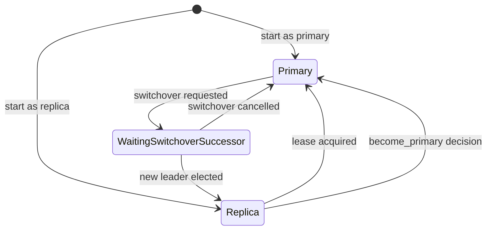

Perform a Planned Switchover

This guide shows how to transfer primary leadership to another cluster member without stopping the cluster.

## Before you begin

Verify cluster state is healthy:

```bash
pgtuskmasterctl ha state
```

Expected output shows `dcs_trust` as `full_quorum`. If trust is `fail_safe` or `not_trusted`, resolve DCS health before proceeding.

Identify target member IDs:

```bash
pgtuskmasterctl ha state
```

Note the `member_count` and `self_member_id` values for each node.

## Submit switchover request

Run against a node API endpoint that can accept admin requests:

```bash
pgtuskmasterctl ha switchover request --requested-by node-b
```

Replace `node-b` with the member ID you want recorded in the switchover request. The command returns:

```json
{"accepted": true}
```

The CLI does not implement automatic retry across nodes. If the request fails, target a different node manually.

## Monitor transition

Poll the HA state every 2 seconds:

```bash
watch -n 2 'pgtuskmasterctl ha state | jq .'
```

Observe these source-backed state changes:

1. **Current primary** moves through:
   - `ha_phase`: `Primary` → `WaitingSwitchoverSuccessor`
   - `ha_decision.kind`: `step_down`
   - `leader`: remains current primary until successor appears

2. **New primary** moves through:
   - `ha_phase`: `Replica` → `Primary`
   - `ha_decision.kind`: `become_primary`
   - `leader`: becomes new member ID

3. **Former primary** after successor appears:
   - `ha_phase`: `WaitingSwitchoverSuccessor` → `Replica`
   - `ha_decision.kind`: `follow_leader`
   - `leader`: new primary member ID

Transition completes when `/ha/state` shows one `Primary` and the other nodes converge on follower behavior.

## Verify new primary

Check SQL role on suspected new primary:

```bash
psql -h new-primary-host -p 5432 -U postgres -d postgres -c "SELECT pg_is_in_recovery();"
```

Returns `f` (false) for primary.

## Clear switchover marker

The primary step-down plan clears the switchover marker automatically during a successful switchover path. Manual cleanup is provided only for cancellation or error scenarios.

If you need to clear a pending switchover request manually:

```bash
pgtuskmasterctl ha switchover clear
```

Returns `{"accepted": true}`. This removes the completed request from DCS.

## Troubleshooting

### Request rejected with transport error

The CLI does not retry across nodes automatically. If the request fails, target a different node manually:

```bash
pgtuskmasterctl ha switchover request --requested-by node-b --endpoint http://node-a:8080
```

### Transition stalls in WaitingSwitchoverSuccessor

This means no replica has healthy PostgreSQL and DCS trust. Check:

```bash
# On each replica
pgtuskmasterctl ha state | jq '.dcs_trust, .ha_phase'
```

Expected: `full_quorum` trust and HA phases that can continue normal progress.

### Multiple primaries appear

Immediately check for split-brain:

```bash
pgtuskmasterctl ha state | jq '.ha_phase' | grep -c Primary
```

If the count exceeds 1, investigate network partitions and DCS connectivity. Automatic fencing of duplicate primaries is not established by the supplied sources.

## State transition diagram



- **Old Primary**: Primary → (switchover request) → WaitingSwitchoverSuccessor → (new leader elected) → Replica
- **New Primary**: Replica → (lease acquired) → CandidateLeader → Primary
- **Replicas**: Continuously poll for leader change and follow new leader
