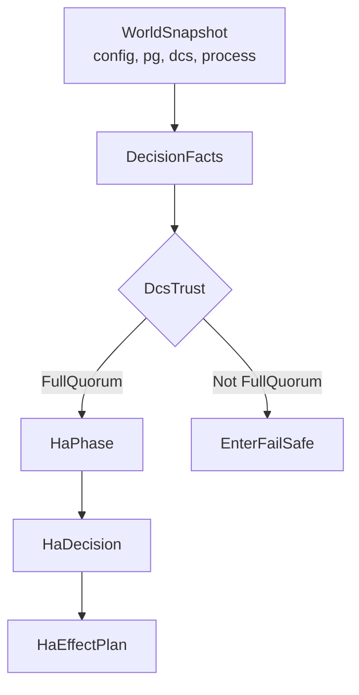

# HA Decisions Reference

The HA decision system determines how pgtuskmaster responds to cluster state changes. Each decision is a sealed command emitted by the HA phase machine in `src/ha/decide.rs` and serialized in the HTTP API at `GET /ha/state`. Decisions are trust-gated: most variants are only emitted while DCS trust is `FullQuorum`.



## Decision Variants

### NoChange
**Fields**: None

**Semantics**: Maintain current state without action. Emitted when conditions are stable or when waiting for processes to complete.

**API Representation**:
```text
{
  "kind": "no_change"
}
```

### WaitForPostgres
**Fields**:
- `start_requested: bool` - Whether the process layer should start PostgreSQL
- `leader_member_id: Option<MemberId>` - Target leader for recovery direction

**Semantics**: Node pauses HA progression until PostgreSQL is reachable. Emitted when PostgreSQL is unreachable or not ready. When `start_requested` is true, the process layer will initiate PostgreSQL startup.

**API Representation**:
```text
{
  "kind": "wait_for_postgres",
  "start_requested": <boolean>,
  "leader_member_id": "<string>" | null
}
```

### WaitForDcsTrust
**Fields**: None

**Semantics**: Node pauses HA progression until DCS trust is restored. Emitted after PostgreSQL becomes reachable but before normal HA decisions can proceed.

**API Representation**:
```text
{
  "kind": "wait_for_dcs_trust"
}
```

### AttemptLeadership
**Fields**: None

**Semantics**: Node should attempt to acquire the leader lease. Emitted when no active leader exists and the node is eligible for promotion.

**API Representation**:
```text
{
  "kind": "attempt_leadership"
}
```

### FollowLeader
**Fields**:
- `leader_member_id: MemberId` - The member ID to follow

**Semantics**: Node should configure replication to follow the specified leader. Emitted when an available primary leader is detected and the local node is in replica phase.

**API Representation**:
```text
{
  "kind": "follow_leader",
  "leader_member_id": "<string>"
}
```

### BecomePrimary
**Fields**:
- `promote: bool` - Whether to execute promotion action

**Semantics**: Node should operate as primary. When `promote` is true, execute promotion workflow. When false, assume primary is already active.

**API Representation**:
```text
{
  "kind": "become_primary",
  "promote": <boolean>
}
```

### StepDown
**Fields**: `StepDownPlan` with:
- `reason: StepDownReason`
- `release_leader_lease: bool` - Whether to release leadership
- `clear_switchover: bool` - Whether to clear switchover request
- `fence: bool` - Whether to trigger fencing

**Semantics**: Node should step down from primary role. The plan flags control which side effects execute. Missing source support for exact lowering behavior.

**API Representation**:
```text
{
  "kind": "step_down",
  "reason": <StepDownReason>,
  "release_leader_lease": <boolean>,
  "clear_switchover": <boolean>,
  "fence": <boolean>
}
```

### RecoverReplica
**Fields**: `RecoveryStrategy` with variants:
- `Rewind { leader_member_id: MemberId }` - Execute pg_rewind against leader
- `BaseBackup { leader_member_id: MemberId }` - Execute base backup from leader
- `Bootstrap` - Bootstrap new replica

**Semantics**: Node should recover to replica state using specified strategy. Emitted after rewind failure or when bootstrap is needed.

**API Representation**:
```text
{
  "kind": "recover_replica",
  "strategy": <RecoveryStrategy>
}
```

### FenceNode
**Fields**: None

**Semantics**: Node should execute fencing workflow to prevent split-brain. Emitted when unsafe primary state is detected.

**API Representation**:
```text
{
  "kind": "fence_node"
}
```

### ReleaseLeaderLease
**Fields**: `LeaseReleaseReason` with variants:
- `FencingComplete` - Fencing workflow finished
- `PostgresUnreachable` - Primary PostgreSQL is unreachable

**Semantics**: Node should release its leader lease without stepping down. Emitted during recovery or fail-safe entry.

**API Representation**:
```text
{
  "kind": "release_leader_lease",
  "reason": <LeaseReleaseReason>
}
```

### EnterFailSafe
**Fields**:
- `release_leader_lease: bool` - Whether to release lease on entry

**Semantics**: Node should enter fail-safe mode due to DCS trust degradation. When `release_leader_lease` is true, also release leadership.

**API Representation**:
```text
{
  "kind": "enter_fail_safe",
  "release_leader_lease": <boolean>
}
```

## Related Payload Types

### StepDownReason
Variants:
- `Switchover` - Planned switchover requested
- `ForeignLeaderDetected { leader_member_id: MemberId }` - Split-brain detected

### RecoveryStrategy
Variants:
- `Rewind { leader_member_id: MemberId }`
- `BaseBackup { leader_member_id: MemberId }`
- `Bootstrap`

### LeaseReleaseReason
Variants:
- `FencingComplete`
- `PostgresUnreachable`

## Phase Context

Each `HaPhase` handler in `src/ha/decide.rs` emits specific decisions:

- **Init**: `WaitForPostgres` (startup)
- **WaitingPostgresReachable**: `WaitForPostgres` or `WaitForDcsTrust`
- **WaitingDcsTrusted**: `WaitForPostgres`, `WaitForDcsTrust`, `FollowLeader`, `AttemptLeadership`, `RecoverReplica`
- **WaitingSwitchoverSuccessor**: `WaitForDcsTrust` or `FollowLeader`
- **Replica**: `WaitForPostgres`, `FollowLeader`, `AttemptLeadership`, `RecoverReplica`, `BecomePrimary`
- **CandidateLeader**: `WaitForPostgres`, `FollowLeader`, `AttemptLeadership`
- **Primary**: `NoChange`, `AttemptLeadership`, `StepDown`, `ReleaseLeaderLease`, `RecoverReplica`
- **Rewinding**: `WaitForPostgres`, `RecoverReplica`, `NoChange` (based on process outcome)
- **Bootstrapping**: `NoChange`, `RecoverReplica`, `FenceNode` (based on process outcome)
- **Fencing**: `NoChange`, `FenceNode`, `ReleaseLeaderLease`
- **FailSafe**: `NoChange`, `ReleaseLeaderLease`

## Trust Gate

At the start of every decision tick, if `DcsTrust` is not `FullQuorum`, normal phase logic is bypassed:

- If local PostgreSQL is primary: `EnterFailSafe { release_leader_lease: false }`
- Otherwise: `NoChange` with phase set to `FailSafe`

Missing source support for exact `DcsTrust` evaluation logic.

## API Exposure

Decisions appear in `GET /ha/state` as the `ha_decision` field. See `docs/src/reference/http-api.md` for endpoint details. Missing source support for exact controller mapping code.

## Lowering to Effects

Decisions are transformed into `HaEffectPlan` in `src/ha/lower.rs`. Missing source support for complete lowering logic. Effect categories include lease operations, replication configuration, PostgreSQL actions, fencing, and switchover cleanup.

## See Also

- [Architecture](explanation/architecture.md) - Conceptual design and phase machine flow
- [HTTP API Reference](http-api.md) - API endpoint details and authorization
