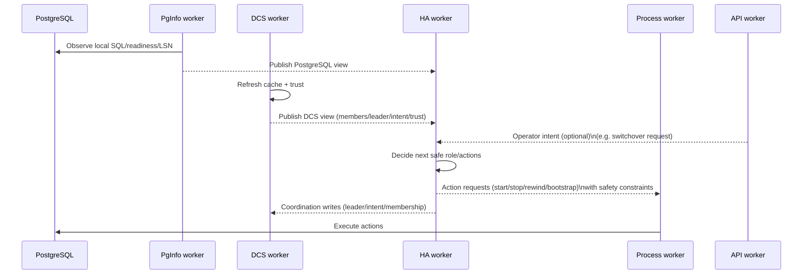

# Control Loop

The steady-state behavior is a reconciliation loop: the system keeps observing and converging until the safest stable role is reached.

One useful way to picture a single “tick” is a sequence diagram:

Important properties:
- Decisions are **guarded** by safety checks.
- Actions are **idempotent** over time (the system converges even if a step is retried).
- DCS trust can intentionally block certain actions.

