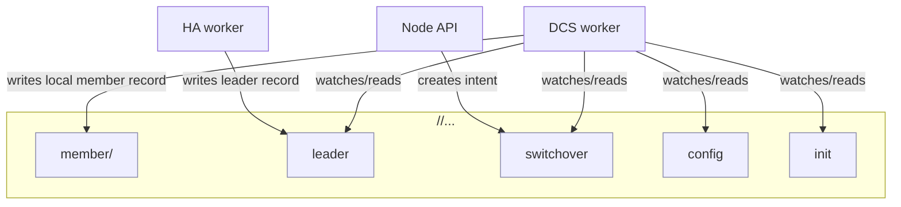

# DCS Keyspace

The DCS (etcd) stores a small set of coordination records under a scoped prefix.

It helps to think of etcd as “shared coordination memory”, with clear ownership:
- some keys are written by the node runtime to publish local facts
- some keys are written by HA/operator intent to coordinate cluster-wide behavior

Note: the bootstrap path can also write:
- `/<scope>/init` (an initialization lock), and
- optionally `/<scope>/config` (seed config payload),
before steady-state workers start.

Operational takeaway:
- DCS health and consistency are treated explicitly via a trust state.
- When trust degrades, HA decisions should become more conservative.
