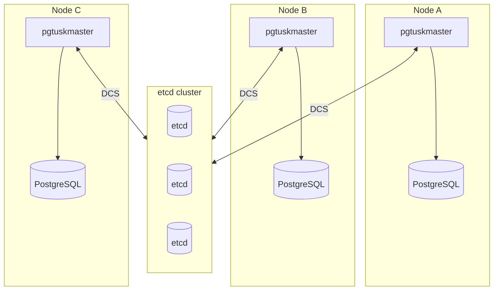

# Deployment Topology

The system is typically deployed as multiple nodes plus a shared etcd cluster.

Operational takeaway:
- etcd availability affects **coordination trust**, but does not directly represent PostgreSQL health.
- Each node has local signals (its own PostgreSQL process), and remote signals (DCS + other members’ records), and the HA logic treats those signals differently when DCS trust degrades.
