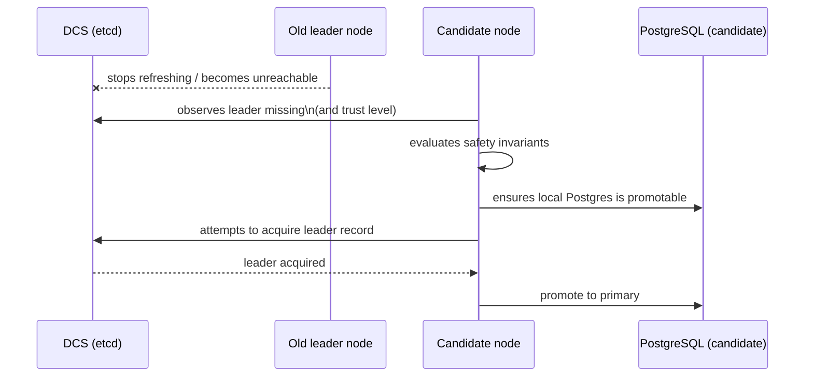
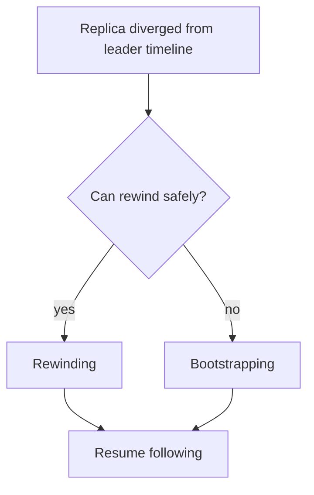

# Failover and Recovery

Failover is “unplanned”: the cluster needs a new primary because the old one disappeared or became unsafe.

Recovery is what makes failover safe:
- replicas must avoid promoting if they might create split brain
- diverged timelines need rewinding or bootstrapping before following again

## Leader loss → new leader

## Divergence recovery (rewind/bootstrap)

The key architectural point is not the mechanics of `pg_rewind` or `pg_basebackup`, but that the node treats “timeline mismatch” as a first-class safety trigger that routes to explicit recovery phases.

