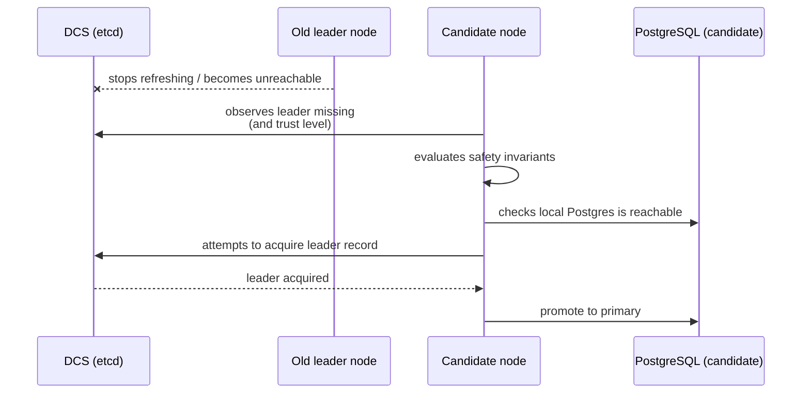
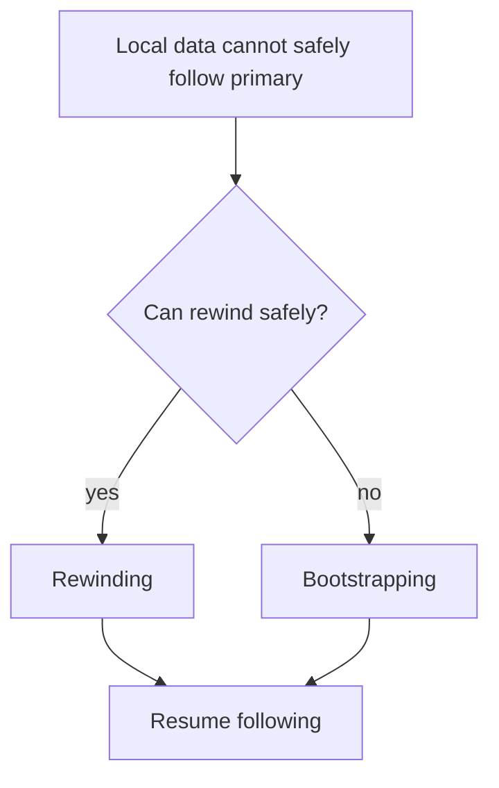

# Failover and Recovery

Failover is “unplanned”: the cluster needs a new primary because the old one disappeared or became unsafe.

Recovery is what makes failover safe:
- the system avoids promoting when it might create split brain (for example, when coordination trust is degraded or when a conflicting leader record exists)
- diverged timelines need rewinding or bootstrapping before following again

## Leader loss → new leader

## Divergence recovery (rewind/bootstrap)

The key architectural point is not the mechanics of `pg_rewind` or `pg_basebackup`, but that the node routes recovery into explicit phases (rewind when possible; otherwise bootstrap) instead of continuing with “best effort” replication under uncertainty.
