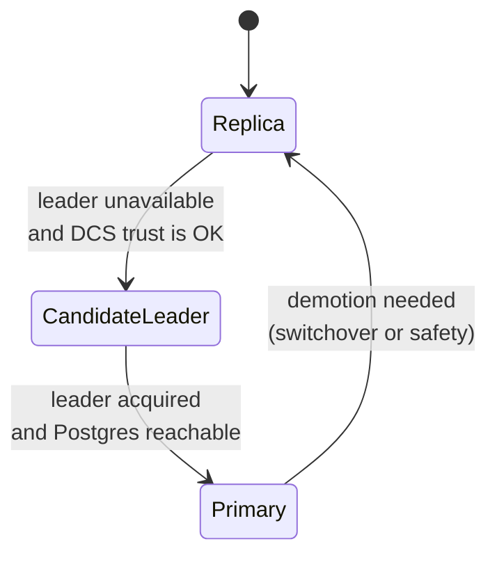
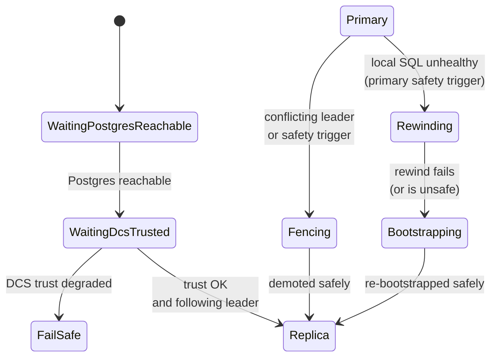

# HA Lifecycle

The HA worker models node behavior as an explicit lifecycle of phases.

To keep diagrams readable, it helps to separate:
- steady-state role phases (Replica/CandidateLeader/Primary)
- recovery and safety phases (Rewinding/Bootstrapping/Fencing/FailSafe)

## Steady-state roles

## Recovery and safety phases

These diagrams are deliberately simplified to convey the architecture; the core concept is that **role changes are gated by trust and safety invariants**.
