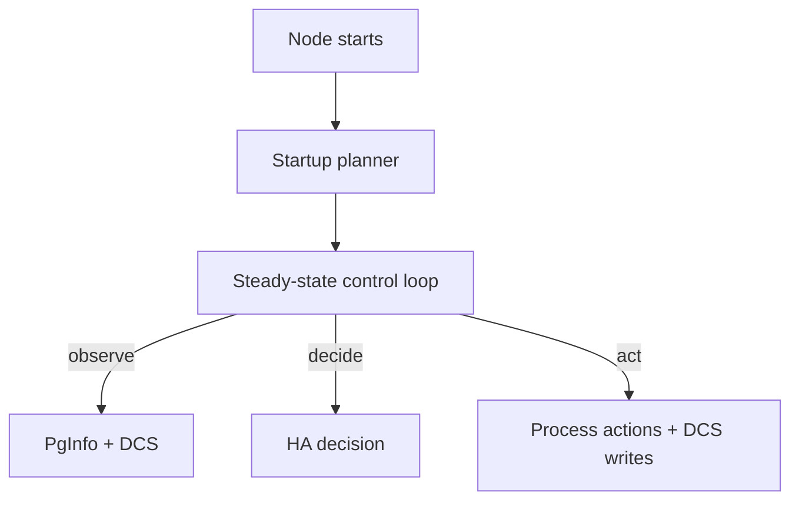

# Architecture

This section explains how the system behaves end-to-end, using diagrams and component interactions.

Key ideas:
- The node runs a **startup planner** once, then enters a **steady-state reconciliation loop**.
- etcd is the **coordination layer** (membership, leader, intent), not an oracle of PostgreSQL truth.
- The design favors **safety** (prevent split brain) over maximal availability under ambiguity.

Suggested reading order inside this section:
1. [System Context](./system-context.md)
2. [Node Runtime](./node-runtime.md)
3. [Control Loop](./control-loop.md)
4. [HA Lifecycle](./ha-lifecycle.md)

