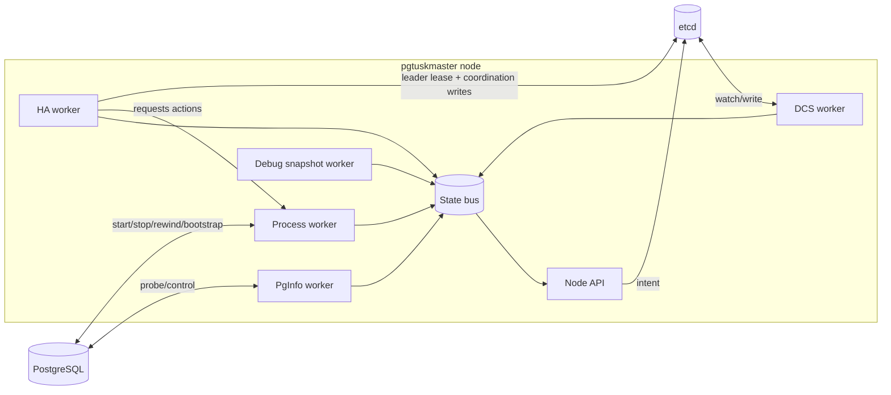

# Node Runtime

The node runtime is best understood as “a set of specialized workers connected by a shared state bus”.

You should think of this as a “closed loop”:
- workers publish observations
- HA decides
- process executes actions
- DCS writes coordination state
- the next loop sees the consequences
