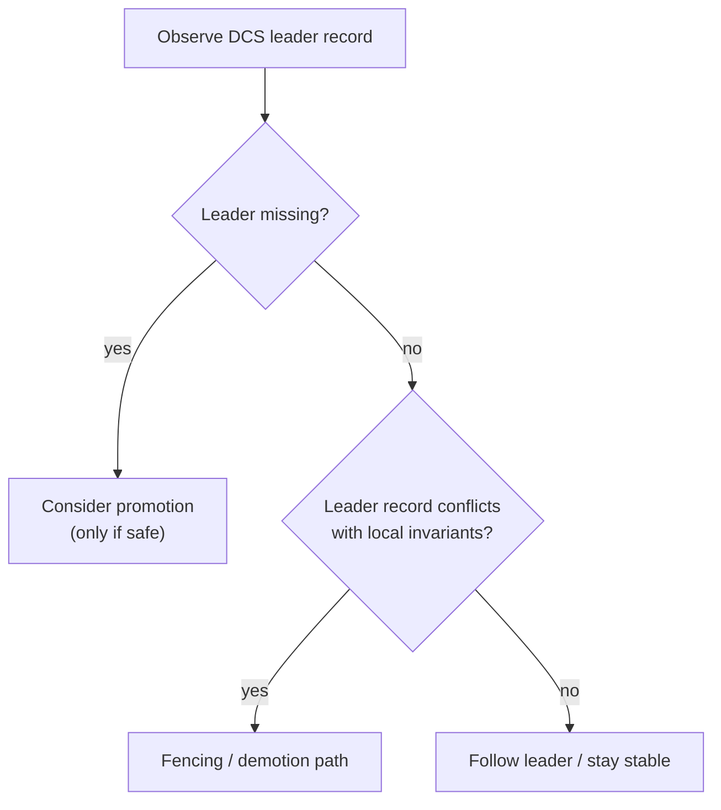

# Safety and Fencing

Safety is the system’s “brake”: when signals are inconsistent, the node should prefer actions that reduce split-brain risk.

Two different situations must be kept distinct:
1. “Leader information is missing/unavailable” → affects follow/promotion decisions
2. “Conflicting leader information exists” → indicates split-brain risk and should trigger fencing

Fencing is not a punishment; it is a safety mechanism.
It is acceptable for the system to become less available temporarily if that prevents two primaries from accepting writes concurrently.
