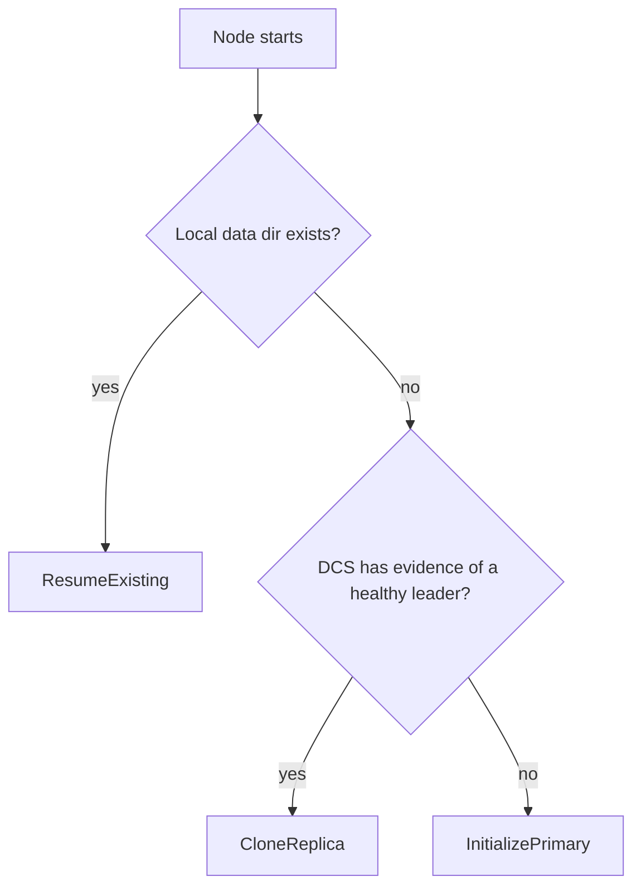

# Startup Planner

Before the node enters steady-state reconciliation, it runs a startup planner once to decide what kind of initialization path is safe.

At a high level, there are three startup outcomes:
- `InitializePrimary`: create/initialize a new primary instance
- `CloneReplica`: clone from an existing primary to become a replica
- `ResumeExisting`: reuse an existing local data directory and recover safely

Why this separation matters:
- Startup decisions affect what “role” the node can safely enter later.
- Inconsistent coordination (trust degraded) should bias toward safer, more conservative startup paths.
