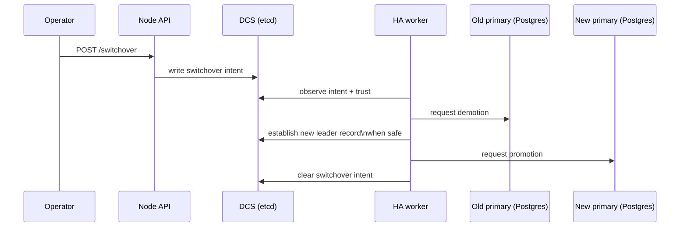

# Switchover

Switchover is “planned”: an operator intentionally requests a controlled primary change.

Unlike failover, switchover is driven by a **human/automation intent** record and should be observable end-to-end.

Architectural goals:
- make the intent explicit and durable (DCS record)
- ensure demotion happens before promotion when safety requires it
- make the switchover observable via node state reporting

