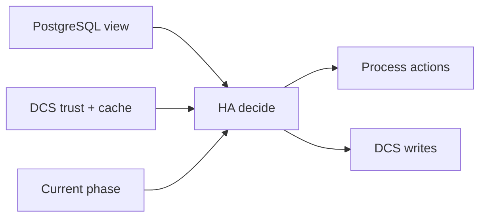

# Decision Model

The HA decision model combines three evidence classes:

- local PostgreSQL state
- DCS trust and coordination records
- current lifecycle phase and safety constraints

Decisions are then projected into process actions and coordination writes.

## How to read a blocked decision

During incident triage, ask which input class is blocking progress:

- local readiness
- trust level
- phase safety guard

Operator control inputs such as switchover requests still enter the same decision path through DCS. They do not bypass the model.
