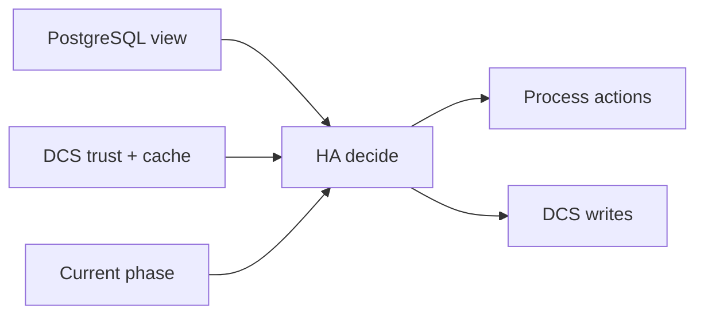

# Decision Model

The HA decision model combines three evidence classes:

- local PostgreSQL state
- DCS trust and coordination records
- current lifecycle phase and safety constraints

Decisions are then projected into process actions and coordination writes.

## Why this exists

A single-source decision model prevents hidden decision channels. Every major transition can be traced back to explicit observed inputs.

## Tradeoffs

The model is intentionally conservative under low-confidence coordination. This can delay actions that appear feasible from one signal alone.

## When this matters in operations

During incident triage, ask which input class is blocking progress: local readiness, trust level, or phase safety guard.
