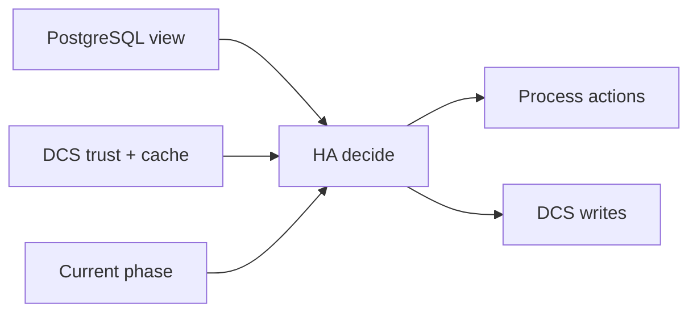

# Decision Model

The HA decision model exists so the runtime can answer one question repeatedly: given the current local PostgreSQL evidence, the current DCS picture, the current trust level, and the current phase, what is the safest next step for this node right now.

## Inputs to the decision

The model draws from three evidence classes plus one control context:

- **local PostgreSQL state**
  This includes reachability, role-like posture, recovery progress, and whether the database is healthy enough for the next step.
- **DCS trust and coordination records**
  This includes whether the store is healthy enough to trust, which members are visible, whether a leader record exists, and whether switchover intent is present.
- **current lifecycle phase**
  The runtime does not decide from scratch on every tick without remembering where it is. Current phase matters because a node in `WaitingSwitchoverSuccessor`, `Rewinding`, `Bootstrapping`, `Fencing`, or `FailSafe` is carrying forward important safety context.
- **operator control input through DCS**
  Planned switchover intent enters through the same shared model rather than bypassing it.

The combination is deliberate. PostgreSQL state alone would make the system too local. DCS state alone would make it too trusting of shared coordination. Phase alone would make it too inertial. The decision model forces those facts to meet in one place.

## Outputs from the decision

The model produces a next HA phase and a next HA decision. That decision is then lowered into a bounded plan of process actions, lease operations, replication actions, safety actions, and switchover side effects. This separation matters:

- the decision layer chooses what kind of action is justified
- the lower/apply layer sequences the concrete side effects
- the published HA state tells operators what the decision layer concluded before every side effect necessarily finishes

That is why accepted intent and completed outcome are distinct. The model may decide that a switchover should proceed, but the concrete work still has to run and the cluster still has to converge safely.

## Conflict handling is part of the model, not an afterthought

The decision logic is explicitly conflict-aware. A node can be locally healthy yet still be constrained by degraded trust, conflicting leader evidence, a pending switchover, or incomplete recovery. Those are not "exceptions around the edges" of the policy. They are central branches of the policy.

This is especially important for reading surprising behavior:

- no leader visible is not identical to safe promotion
- accepted switchover intent is not identical to safe completion
- finished process work is not identical to safe rejoin
- a locally healthy primary is not identical to a cluster-safe primary when another leader signal appears

## How to read a blocked decision

When the runtime is not progressing, ask which input class is blocking it:

- **local readiness blocker**
  PostgreSQL is unreachable, recovery is still in progress, or a process job has not yet succeeded.
- **trust blocker**
  The DCS picture is too weak to justify normal promotion or handoff behavior.
- **phase safety blocker**
  The node is in a phase that requires a specific precondition before leaving it, such as successor visibility during switchover or successful rewind/bootstrap before rejoin.
- **coordination conflict blocker**
  Another leader or contradictory DCS record is visible strongly enough to force restraint or fencing.

That framing is useful because it tells you where to investigate next. If you treat every delay as a generic failure, you lose the ability to distinguish intentional safety holds from broken dependencies.

## Why operator intent does not bypass the model

Planned switchover is the clearest example of the design choice. The API can write intent into the DCS, but the HA loop still decides whether trust is sufficient, whether the current primary can step down safely, whether a successor is eligible, and whether the system should clear the switchover record. This means operator input is real, but it remains subject to the same evidence discipline as automatic failover behavior.

That is one of the strongest safety properties in the architecture. It prevents the system from having one strict path for automated behavior and one bypass path for human-triggered behavior.
