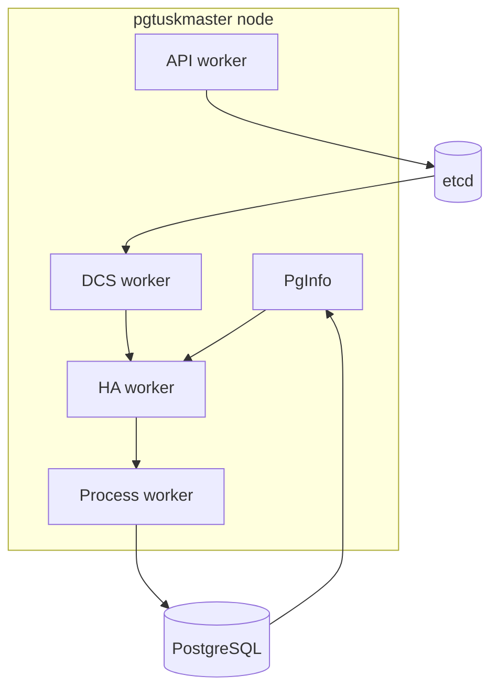

# Runtime Topology and Boundaries

A node is intentionally split into specialized workers with bounded responsibilities. That split is not just an implementation convenience. It is part of the safety story, because it separates observation, decision-making, side effects, and operator-facing publication instead of letting one large loop do everything implicitly.

## Worker responsibilities

### `pginfo`

`pginfo` polls local PostgreSQL and publishes the node's current local database posture. Its job is observation, not policy. It tells the rest of the system whether PostgreSQL is reachable and what kind of state it appears to be in.

### `dcs`

The DCS worker publishes local member state and refreshes the shared coordination cache from etcd. It also computes trust from the health of the store and the quality of the current cache view. This means it owns the quality of shared evidence, but it does not decide promotions or demotions on its own.

### `ha`

The HA worker is the policy engine. It consumes the latest config, local PostgreSQL state, DCS state, and process state, decides the next phase and decision, publishes that HA state, and lowers decisions into concrete effect plans. It is the place where the system's conservative bias is encoded most directly.

### `process`

The process worker owns side effects against PostgreSQL and related tooling: start, stop, promote, demote, rewind, base backup, bootstrap, and fencing-oriented work. It executes jobs and reports outcomes back into the state stream. This separation is important because a sound HA decision can still fail in execution, and the runtime needs to represent that distinction cleanly.

### `api` and debug snapshot path

The API worker serves operator-facing contracts, including `/ha/state`, switchover routes, fallback routes, and optional debug routes. The debug snapshot path aggregates config, pginfo, DCS, process, and HA state into a coherent published snapshot and change timeline. These surfaces are deliberately downstream of the workers they describe rather than being alternate control planes.

## Why the boundaries help assurance

This topology provides several assurance benefits:

- observation faults are easier to distinguish from policy faults
- policy faults are easier to distinguish from side-effect execution faults
- operator-facing publication can continue even when the system is behaving conservatively under degraded coordination
- write ownership in the DCS stays narrow because not every worker is allowed to mutate coordination state freely

In other words, the topology turns one big opaque control loop into a set of bounded responsibilities that can be reasoned about independently and then recomposed.

## Synchronization expectations

The workers are not perfectly synchronous, and the design does not pretend they are. State flows through publications and subscriptions, which means there can be short windows where:

- a process action has started but the next HA projection has not yet reflected the outcome
- DCS state has changed but the API still serves the previous snapshot until the next publication arrives
- PostgreSQL observation has recovered but the next HA tick has not yet reevaluated leadership

Those windows are normal as long as they converge quickly and the published story remains coherent. The important boundary is that the workers publish explicit state transitions instead of hiding them inside an all-in-one imperative script.

## How to use this map during diagnosis

When a symptom appears, first ask which boundary owns it:

- observation problem: `pginfo` or `dcs`
- trust and coordination quality problem: `dcs`
- decision problem: `ha`
- side-effect problem: `process`
- intent, auth, or published-read problem: `api` or the debug snapshot publication path

That question reduces both debugging scope and documentation ambiguity. It also keeps contributors from "fixing" an issue by crossing a boundary that the current design intentionally keeps separate.
