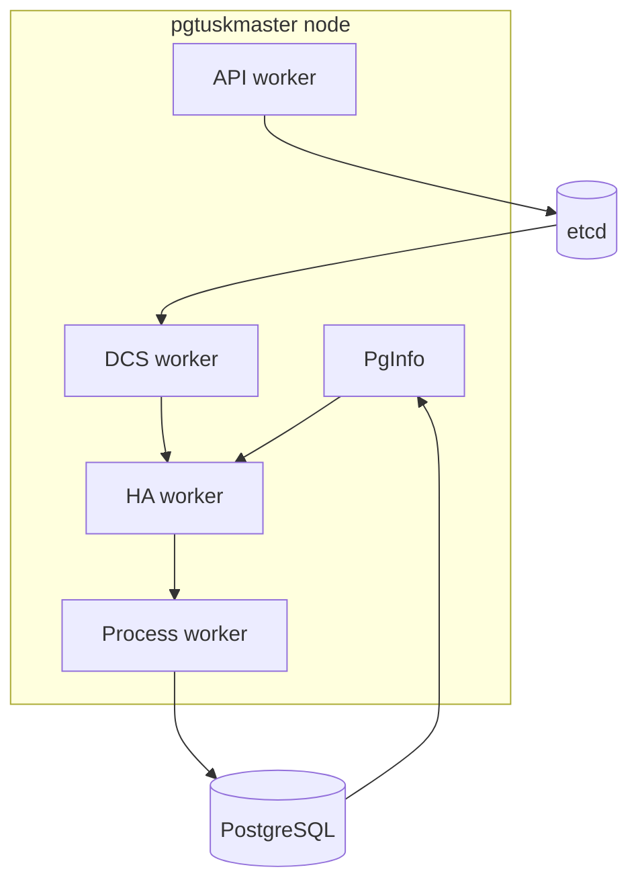

# Runtime Topology and Boundaries

A node contains multiple specialized workers with bounded responsibilities. In practice it manages a local PostgreSQL instance and participates in DCS coordination, with additional API, debug, and logging workers to expose state and operator controls.

## How to use this map

When a symptom appears, ask which boundary owns it:

- observation problem: `pginfo` or `dcs`
- decision problem: `ha`
- side-effect problem: `process`
- intent or read problem: `api`

That keeps incident analysis and code changes scoped to the right subsystem.
