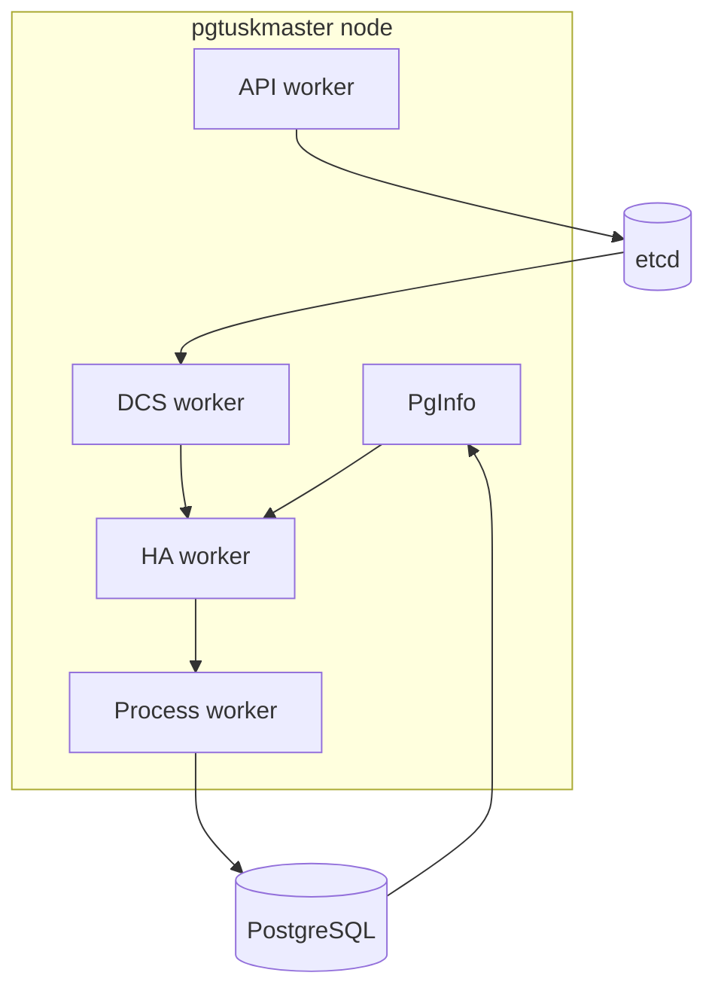

# Runtime Topology and Boundaries

A node contains multiple specialized workers with bounded responsibilities. The system boundary is local PostgreSQL management plus DCS coordination.

## Why this exists

Bounded worker responsibilities reduce coupling and make transition reasoning clearer.

## Tradeoffs

More explicit worker boundaries create more internal interfaces. The benefit is better observability and easier targeted testing of behavior paths.

## When this matters in operations

When a symptom appears, this topology helps identify whether the issue starts in observation, decision, action, or coordination.
