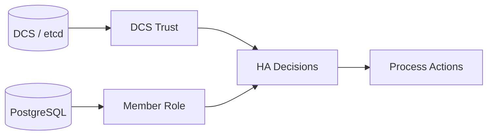

# Glossary

This glossary defines the terms used in this book.

## Terms
- DCS: Distributed configuration store used for coordination (etcd).
- Scope: Prefix used to namespace keys in the DCS (for example, `/<scope>/leader`).
- Member: One node in a cluster, identified by a stable member ID.
- Leader record: DCS record indicating which member is the primary leader.
- Switchover request: Operator-created intent to perform a planned role change.
- Fencing: A safety action that prevents a node from acting as primary when signals suggest split-brain risk.
- Startup planner: Startup-time decision of whether this node should initialize a new primary, clone as a replica, or resume existing state.

