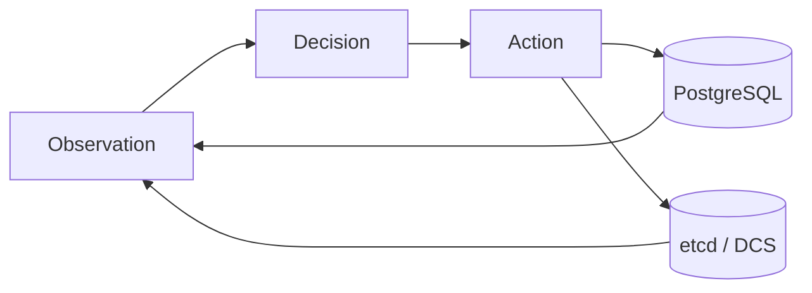

# Concepts

This section defines the vocabulary used throughout the book.

The system is easiest to understand if you separate:
- **Observation** (what PostgreSQL and the DCS look like right now)
- **Decision** (what role the node should be in)
- **Action** (starting/stopping/reconfiguring PostgreSQL, writing coordination state)

If you only remember three things:
1. The system is a reconciliation loop: observe → decide → act.
2. etcd is coordination state, not a source of truth for PostgreSQL health.
3. Safety dominates liveness under conflicting signals.

