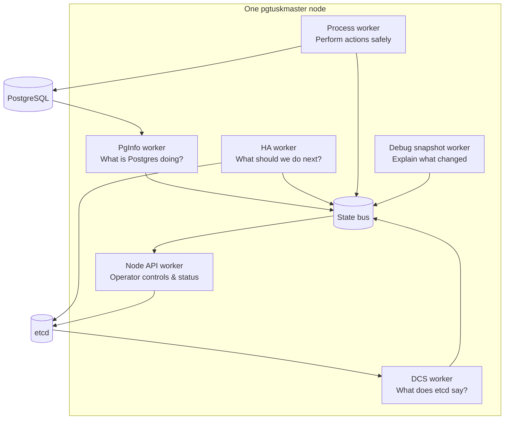

# Mental Model

At runtime, a node behaves like a small control plane: several specialized components continuously share state and converge on a safe role for PostgreSQL.

The important mental model is **ownership**: each component owns one slice of the world and publishes it for others to consume.

What to look for when debugging behavior:
- If PostgreSQL is down or misconfigured: start with `PgInfo`.
- If coordination looks wrong or stale: start with `DCS` trust and cache.
- If the node refuses promotion: check `HA` safety/fencing decisions.
- If the node is “doing nothing”: check whether `Process` is blocked on a safety precondition.
