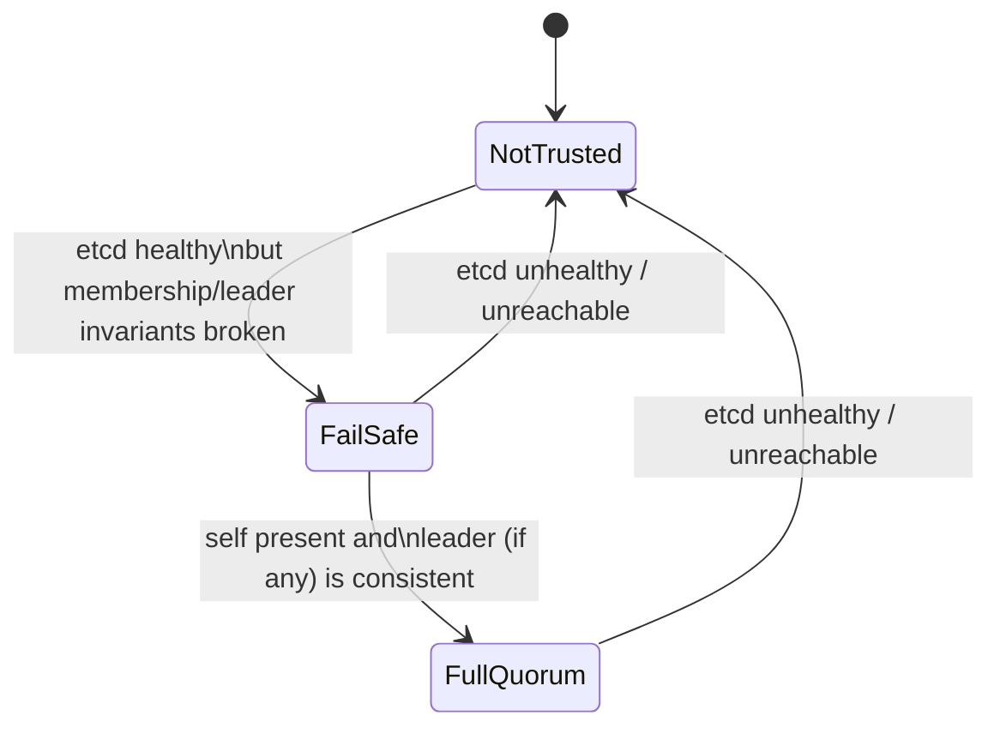

# Roles, Trust, and Quorum

This project uses two separate notions that people often conflate:
- **Role**: what PostgreSQL should be doing (Primary vs Replica).
- **Trust**: whether the node considers DCS information safe enough to act on.

## Cluster roles (at a high level)
Every member is conceptually in one of these roles:
- Primary: accepts writes
- Replica: follows the primary
- Unknown: not currently safe to classify

## DCS trust states
The DCS worker publishes a trust level that constrains HA decisions.

Interpretation:
- `NotTrusted`: DCS is unhealthy; the node should avoid actions that depend on coordinated consensus.
- `FailSafe`: etcd is reachable, but the cluster view is inconsistent (for example, self is missing or a recorded leader is missing). Treat this as “coordination degraded”.
- `FullQuorum`: DCS is healthy and consistent enough for normal HA actions.

This is not generic textbook quorum language; it is the system’s explicit safety contract.
