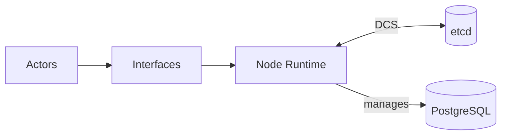

# Docs Style (Architecture, No Code)

These docs are meant to stay **reader-first** and **architecture-level**.

## The rule of thumb
Write in terms of *components reacting to signals*:
> “Component X reacts when component Y changes Z.”

Avoid narrating how the code does it (no function-by-function explanations, no signature/argument walkthroughs).

## Allowed fenced blocks
In architecture-oriented chapters (`Concepts`, `Architecture`, `Interfaces`, `Testing`), fenced blocks must be:
- `mermaid` (diagrams)
- tiny `console` / `bash` (orientation only)
- tiny `toml` (orientation only)
- `text` (rare; use for non-code structured excerpts)

Programming-language code fences (including `rust`) are intentionally disallowed in those chapters.

## Diagram conventions
We use Mermaid for almost everything.

Diagram style guidance:
- Prefer **few boxes with clear labels** over many micro-components.
- Show **failure paths** explicitly (timeouts, missing trust, conflicting leader).
- Keep names consistent across pages (use the same actor/component label everywhere).

