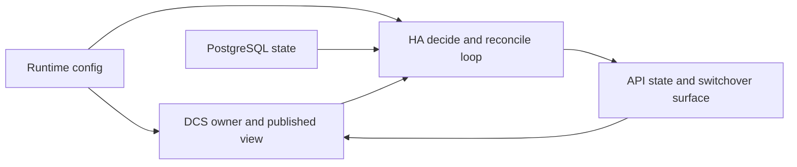
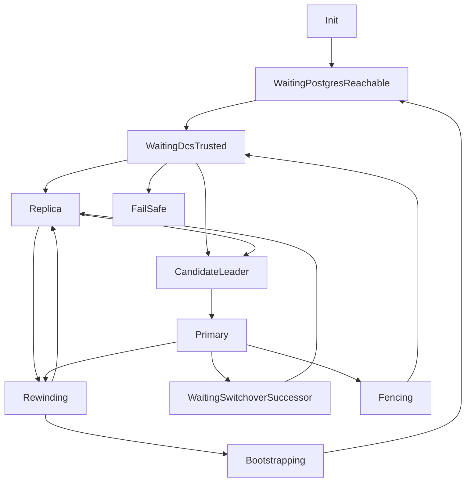
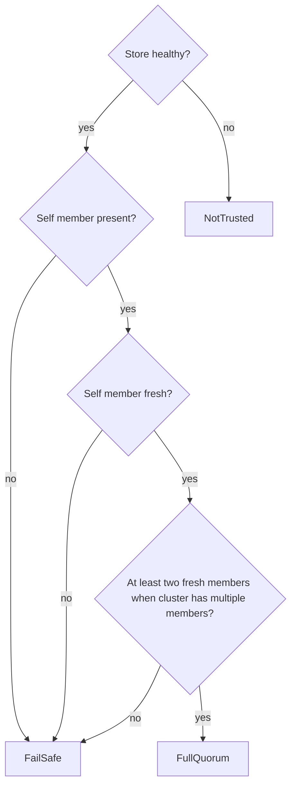

# Architecture

pgtuskmaster is a high-availability orchestrator for PostgreSQL that prioritizes split-brain prevention through a state-driven decision loop, explicit trust modeling, and clear boundaries between DCS state, HA intent, and API projection.

## Core Design Principles

The HA worker is structured as a deterministic observe/decide/reconcile loop. Each tick derives a `WorldView`, decides the desired local role plus the operator-facing authority publication, and then reconciles that desired state into an ordered action list. The decision logic in [`src/ha/decide.rs`](/home/joshazimullah.linux/work_mounts/patroni_rewrite/pgtuskmaster_rust/src/ha/decide.rs) stays pure, while [`src/ha/reconcile.rs`](/home/joshazimullah.linux/work_mounts/patroni_rewrite/pgtuskmaster_rust/src/ha/reconcile.rs) turns that intent into concrete work such as demotion, rewind, promotion, or publication changes.

Safety is enforced through trust gating. The DCS trust model in [`src/dcs/state.rs`](/home/joshazimullah.linux/work_mounts/patroni_rewrite/pgtuskmaster_rust/src/dcs/state.rs) can downgrade the node to `FailSafe` or `NotTrusted` when etcd health, member freshness, or leader freshness is not good enough for normal HA decisions. That means the system does not treat DCS availability as a convenience layer; it is a prerequisite for leadership behavior.

The module split in [`src/lib.rs`](/home/joshazimullah.linux/work_mounts/patroni_rewrite/pgtuskmaster_rust/src/lib.rs) also reflects those boundaries. `ha` owns decision logic, `dcs` owns cluster-state storage concerns, `config` owns runtime configuration, and `api` maps internal state into response types and switchover control entry points.

## Component Organization

The crate root exposes the major public areas: `api`, `cli`, `config`, `dcs`, `pginfo`, `runtime`, and `state`. Internal modules such as `ha`, `logging`, `process`, `postgres_managed`, and `tls` carry the coordination and implementation details.

The HA layer produces stable outputs such as:
- `authority = primary` with a lease epoch
- `authority = no_primary` with a structured reason
- `ha_role = leader`, `candidate`, `follower`, `fail_safe`, `demoting_for_switchover`, `fenced`, or `idle`
- ordered reconcile actions such as `promote`, `start_replica`, `pg_rewind`, or `clear_switchover`
- `FenceNode`
- `ReleaseLeaderLease`
- `EnterFailSafe`

Those role and authority outcomes are selected in [`src/ha/decide.rs`](/home/joshazimullah.linux/work_mounts/patroni_rewrite/pgtuskmaster_rust/src/ha/decide.rs), represented by the shared HA model in [`src/ha/types.rs`](/home/joshazimullah.linux/work_mounts/patroni_rewrite/pgtuskmaster_rust/src/ha/types.rs), and turned into ordered work by [`src/ha/reconcile.rs`](/home/joshazimullah.linux/work_mounts/patroni_rewrite/pgtuskmaster_rust/src/ha/reconcile.rs).

The DCS layer is now a single owner component. Runtime creates one DCS worker, that worker owns the etcd client and internal cache, and the rest of the system only sees a read-only `DcsView` plus typed commands such as acquire leadership, release leadership, publish switchover, and clear switchover. Non-DCS modules no longer manipulate raw DCS paths or internal cache records directly.

The API layer in [`src/api/controller.rs`](/home/joshazimullah.linux/work_mounts/patroni_rewrite/pgtuskmaster_rust/src/api/controller.rs) has two main responsibilities:
- project internal HA and DCS state into stable response enums and structs
- send typed switchover commands to the DCS worker

That keeps the API as a control and observability surface rather than the place where HA decisions are computed or raw DCS keys are mutated.

## HA Phase Machine

The HA state includes these phases:
- `Init`
- `WaitingPostgresReachable`
- `WaitingDcsTrusted`
- `WaitingSwitchoverSuccessor`
- `Replica`
- `CandidateLeader`
- `Primary`
- `Rewinding`
- `Bootstrapping`
- `Fencing`
- `FailSafe`

The phase handlers in [`src/ha/decide.rs`](/home/joshazimullah.linux/work_mounts/patroni_rewrite/pgtuskmaster_rust/src/ha/decide.rs) show the intended flow:
- startup moves from `Init` toward PostgreSQL reachability and then DCS trust
- a trusted node without a leader can move into `CandidateLeader`
- a trusted node with a follow target stays or becomes `Replica`
- a node that holds leadership moves into `Primary`
- degraded trust can move the node into `FailSafe`
- unsafe leader situations can move the node into `Fencing`
- replica recovery can route through `Rewinding` or `Bootstrapping`

The exact next state still depends on the current facts. For example, `Primary` can step down on switchover, enter fencing when another active leader is detected, or release leadership when PostgreSQL becomes unreachable.

## Trust and Safety Model

Trust evaluation in [`src/dcs/state.rs`](/home/joshazimullah.linux/work_mounts/patroni_rewrite/pgtuskmaster_rust/src/dcs/state.rs) is one of the key architectural constraints:
- `NotTrusted` is used when the backing store is unhealthy
- `FailSafe` is used when the store is healthy but the local member is missing or stale, or when a multi-member view lacks enough fresh members
- `FullQuorum` is used only when the store is healthy and the cache is fresh enough to support normal HA behavior

Freshness is checked against `ha.lease_ttl_ms`, using each member record's `updated_at` timestamp. In multi-member caches, the code requires at least two fresh members before returning `FullQuorum`.

Leader liveness is handled separately from trust. The etcd-backed store writes `/{scope}/leader` under an etcd lease whose TTL is also derived from `ha.lease_ttl_ms`. When the owning node dies hard and keepalive stops, etcd expires the lease and the watch-fed DCS cache drops the leader record automatically. The leader record also carries a `generation`, turning it into a lease epoch instead of a bare member label.

The HA decision logic uses that trust result immediately. At the top of `decide`, if trust is not `FullQuorum`, the node moves into a fail-safe role; if it is still primary at that moment, the published authority also withdraws from `primary` and may carry a fence cutoff.

This trust gate is the reason the architecture puts so much weight on DCS freshness instead of only local PostgreSQL status. Local primary state is not enough on its own.

## Configuration in the Architecture

Runtime configuration shapes almost every subsystem. The schema in [`src/config/schema.rs`](/home/joshazimullah.linux/work_mounts/patroni_rewrite/pgtuskmaster_rust/src/config/schema.rs) defines top-level sections for:
- `cluster`
- `postgres`
- `dcs`
- `ha`
- `process`
- `logging`
- `api`
- `debug`

That config controls cluster identity, DCS scope, PostgreSQL connection and authentication details, process binary paths, HA timing, log sinks, and API security settings. The Docker example at [`docker/configs/cluster/node-a/runtime.toml`](/home/joshazimullah.linux/work_mounts/patroni_rewrite/pgtuskmaster_rust/docker/configs/cluster/node-a/runtime.toml) shows the sections together in a complete runtime config file.

Configuration still shapes DCS behavior through scope, endpoints, and timing, but that wiring remains inside the DCS component instead of leaking through the public API/state surface.

## Observability and Control

The controller surface in [`src/api/controller.rs`](/home/joshazimullah.linux/work_mounts/patroni_rewrite/pgtuskmaster_rust/src/api/controller.rs) maps internal state into API responses that include:
- cluster name
- scope
- self member id
- leader
- switchover pending
- member count
- DCS trust
- authority
- fence cutoff
- HA role
- planned actions
- snapshot sequence

The same controller also accepts switchover commands and forwards them to the DCS worker. That means operator intent still enters through the API, but only the DCS component owns persistence and only the HA loop decides how to satisfy the request.

The current HA surface still treats split-brain avoidance as a first-class invariant. That shows up in the cluster state exposed by the controller, in the HA decision logic, and in the surviving greenfield HA end-to-end coverage under `tests/ha/`, rather than through the deleted legacy observer helper.

## Summary

The core architectural pattern is: collect state, evaluate trust, decide local role and published authority, reconcile that into ordered actions, then expose the result through the API. The important constraint is that leadership is trust-gated. DCS freshness, member freshness, lease epochs, and explicit safety publication are the mechanisms that keep high availability behavior explainable and defensive.
