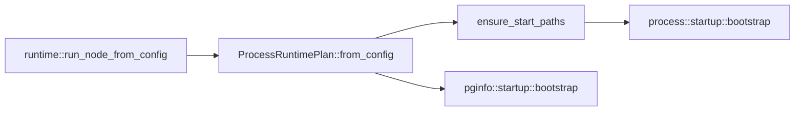
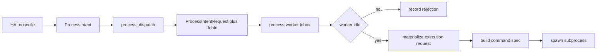
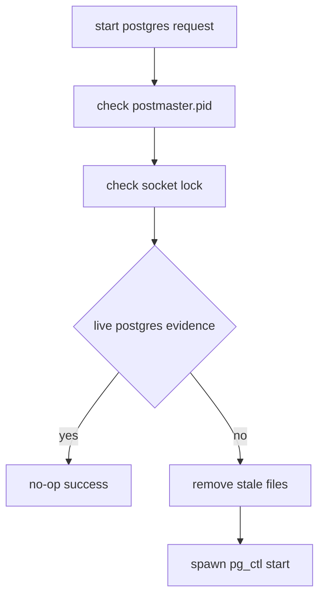
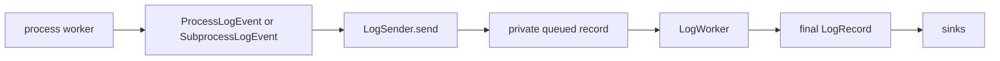

# Process Management and Execution Domain

Process management is the execution boundary between the HA reconciler and the operating system. The HA side decides what should happen next based on cluster state and policy. The process domain turns that decision into concrete PostgreSQL subprocess work, records the outcome, and publishes state for the rest of the node. This separation keeps HA logic pure and ensures process execution concerns do not leak into higher-level decision-making.

## Why This Boundary Exists

The HA decision engine must remain focused on cluster state and safety invariants. It should not contain code that knows how to spawn `postgres`, `pg_rewind`, or `pg_basebackup`. Conversely, the process layer should not need to understand HA concepts like quorum, fencing, or switchover coordination. The boundary between them is a narrow channel of typed intents.

## Startup Composition

Runtime startup moved process-specific policy into `ProcessRuntimePlan` and `process::startup::bootstrap`. The plan is a typed projection of runtime config that the process and pginfo domains need repeatedly:

- Managed PostgreSQL paths and listen port
- Replication-source defaults for replicator and rewinder jobs
- Connection defaults such as database name, SSL mode, CA path, and connect timeout

`ProcessRuntimePlan::ensure_start_paths()` creates the data directory parent, data directory, socket directory, and log parent before workers start. On Unix systems it additionally sets `0o700` permissions on the data directory to match PostgreSQL expectations.

At the composition root, `src/runtime/node.rs` creates the plan once, prepares paths once, and passes the typed plan into owning startup modules instead of rebuilding loose strings across domains.

## Worker Context Shape

`ProcessWorkerCtx` groups concerns into narrower abstract data types:

- `cadence`: worker poll interval and time source
- `config`: process-level timeout and binary configuration
- `identity`: the local `MemberId`
- `observed`: live `RuntimeConfig` and `DcsView` subscribers
- `plan`: the stable `ProcessRuntimePlan`
- `state_channel`: current `ProcessState`, publisher, and last rejection
- `control`: the inbox plus optional active runtime
- `runtime`: logging, subprocess-output capture flag, and command runner

That split keeps the startup boundary smaller and makes cross-domain dependencies more explicit. The worker reads local identity and long-lived runtime defaults from typed bundles instead of from many unrelated top-level fields.

## Intent Flow from HA to Process

The HA reconciler never spawns a subprocess directly. It emits `ProcessIntent` values such as:

- `Bootstrap`
- `ProvisionReplica(BaseBackup | PgRewind)`
- `Start(Primary | DetachedStandby | Replica)`
- `Promote`
- `Demote(Fast | Immediate)`

`src/ha/process_dispatch.rs` converts each intent into a `ProcessIntentRequest` with a deterministic `JobId` built from scope, member id, HA tick, action index, and intent label. That request is sent through the process worker inbox. If the worker is already busy, the new request is rejected without starting a second job. That rejection is recorded in `state_channel.last_rejection` and logged as a worker event.

## Materialization and Validation

The process worker turns `ProcessIntentRequest` into a concrete `ProcessExecutionRequest` inside `materialize_execution_request(...)`. For replica-provisioning paths, materialization reads the latest DCS view and validates the chosen leader before building connection info:

- The source member must not be `self`
- The advertised PostgreSQL host must be non-empty
- The source member must currently present as a primary in DCS

Those checks live in `src/process/source.rs` and use the typed replication-source defaults stored in `ProcessRuntimePlan`. That keeps replication-source policy in the process domain instead of leaving it spread across HA and runtime startup code.

The same materialization step also converts start intents into concrete PostgreSQL start specifications, including detached-standby and replica-start managed configuration.

## Job Lifecycle and Timeouts

`ProcessState` exposes two high-level states:

- `Idle { worker, last_outcome }`
- `Running { worker, active }`

Internally, `ActiveRuntime` holds the execution request, deadline, process handle, and structured log identity for the running job.

Timeouts are enforced by deadline checks inside `tick_active_job(...)`. Different execution kinds resolve to different timeout defaults from `ProcessConfig`:

- bootstrap, basebackup, promote, and start-postgres use the bootstrap timeout unless the spec overrides it
- pg_rewind uses the pg_rewind timeout unless overridden
- demote uses the fencing timeout unless overridden

When the deadline is exceeded, the worker logs a timeout event, calls the process handle cancellation path, drains any remaining output, and transitions back to idle. In the current implementation that cancellation path is kill-based: `TokioProcessHandle::cancel()` uses `start_kill()` followed by `wait()`. A successful cancellation produces `JobOutcome::Timeout`; a cancellation failure becomes `JobOutcome::Failure`.

Subprocess output is drained during execution and again during shutdown paths. When `logging.capture_subprocess_output` is enabled, the process startup bundle projects that setting into `ProcessRuntime.capture_subprocess_output`, and stdout/stderr lines cross into the logging subsystem as typed subprocess events. The logging package then serializes those events into final log records tagged with the job identity.

## PostgreSQL Preflight Safety

The start-postgres path does extra preflight work before spawning `pg_ctl start`:

- It checks `postmaster.pid` in the configured data directory
- It verifies whether that PID still exists and, on Unix, whether `/proc/<pid>/cmdline` looks like a PostgreSQL postmaster for the same data directory
- It checks the PostgreSQL socket lock file for the configured port
- If the PID or socket-lock evidence is stale, it removes the stale files before continuing
- If PostgreSQL already appears to be running for that data directory or port, the start job becomes a no-op success instead of spawning another process

This keeps the start path crash-tolerant and reduces false-positive "already running" failures after unclean shutdowns.

## Integration with PgInfo and API

The pginfo domain now shares the same `ProcessRuntimePlan` at startup rather than rebuilding its local socket target in `runtime/node.rs`. `PgProbeTarget::local_from_config(...)` derives the local probe connection info from the runtime config plus the process plan, so the process and pginfo domains agree on the managed socket directory and port.

The API domain no longer reaches into process startup details either. It consumes published process state through its live observed-state bundle. During startup, the API can stay in `ApiObservedState::Unavailable` until the full live subscriber set is ready, which avoids pretending that partially wired state is already live.

## Logging Boundary

The logging subsystem centers on an opaque `LogSender` handle. Process code does not create JSON records or interact with tracing APIs. Instead, each domain owns typed log ADTs that implement a sealed logging contract.

The process domain defines:

- `ProcessLogEvent` for worker lifecycle and job control events
- `SubprocessLogEvent` for stdout/stderr lines from child processes

Process worker code constructs these typed events and calls `ctx.runtime.log.send(...)` directly. The `LogSender` filters by minimum severity, materializes events into a private queue shape, and forwards them to the background worker. Backend sink failures after enqueue remain internal to logging and do not affect process execution.

This boundary ensures process execution code remains focused on process supervision while still producing rich, structured logs for observability.

## Why This Boundary Is Better

The rewrite makes `src/runtime/node.rs` a smaller composition root:

- runtime validates top-level config and boots global services
- process startup owns process-specific path preparation and runtime projection
- pginfo startup owns its local probe target
- HA sends typed intents instead of process commands
- API consumes published state instead of process internals

That boundary reduces startup duplication, shrinks the number of raw fields runtime must know about, and keeps process execution policy close to the code that actually launches and supervises PostgreSQL subprocesses.
