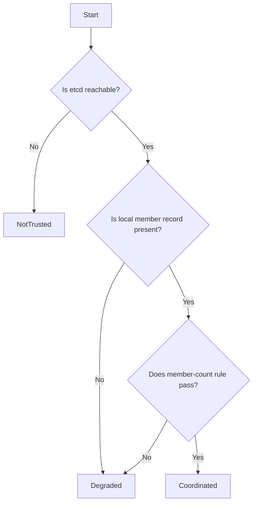

# Trust Model and DCS Coordination Modes

The trust model defines when a node considers the distributed consensus store (DCS) safe enough for high-availability decisions. It uses three coordination modes that gate all failover behavior.

## Coordination Modes

A node operates in exactly one of three modes at any time:

- **NotTrusted**: The DCS transport is unreachable. The node retains its last observed cluster snapshot but refuses coordinated actions.
- **Degraded**: The DCS is reachable, but the node lacks sufficient confidence for authoritative decisions. This occurs when the node cannot see its own member record or the minimal member-count rule fails.
- **Coordinated**: The DCS is reachable, the node's member record is visible, and the minimal member-count rule passes. Normal leader/follower logic is permitted.

## Mode Evaluation Logic

The `evaluate_mode()` function in `src/dcs/state.rs` determines the mode in this strict order:

1. If etcd is unreachable → **NotTrusted**
2. If the local node's member record is absent from DCS → **Degraded**
3. If the member-count rule fails → **Degraded**
4. Otherwise → **Coordinated**

### Member-Count Rule

The `has_member_quorum()` function in `src/dcs/state.rs` implements a minimal safety rule, not majority quorum mathematics:

- 1 visible member → coordinated
- 2+ visible members → require at least 2 members for coordinated mode

This distinguishes single-node deployments (where one member suffices) from multi-member deployments (where seeing only one member signals a problem).

## Freshness and Self-Visibility

**Self-visibility** is a critical safety property: a node must see its own member record in the authoritative DCS cache to enter coordinated mode. This prevents a node from making authoritative decisions when it is partitioned from the cluster's view of itself.

**Freshness** is operationally defined by `ha.lease_ttl_ms` (default 10 seconds). If the node's PostgreSQL observation age exceeds this threshold, the node deletes its DCS member entry and releases any leadership lease.

## HA Decision Gating

The mode directly gates high-availability decisions in `src/ha/decide.rs`:

- **Coordinated**: Normal leader/follower logic executes. Elections, promotions, and switchovers are permitted.
- **Degraded** or **NotTrusted**: The system immediately enters fail-safe behavior. Primaries may be forced to stop, replicas continue following their last known upstream, and the operator-visible primary is withdrawn.

## Practical Example: DCS Quorum Loss

The test scenario in tests/ha/features/ha_dcs_quorum_lost_enters_failsafe demonstrates the model's consequences:

1. A healthy cluster with one stable primary
2. DCS quorum majority stops
3. Nodes lose coordinated mode and withdraw the operator-visible primary
4. All running nodes report fail-safe status
5. No dual-primary anomalies appear during transition
6. DCS quorum restoration returns the cluster to coordinated mode and one stable primary

This shows the model's conservative nature: it withdraws authority before allowing dangerous ambiguity.

## Design Rationale

The model favors simplicity and safety over complex quorum calculations. It avoids majority mathematics, instead using explicit etcd reachability, self-visibility, and a minimal member-count rule. This makes behavior predictable and easy to reason about during network partitions and DCS outages.
