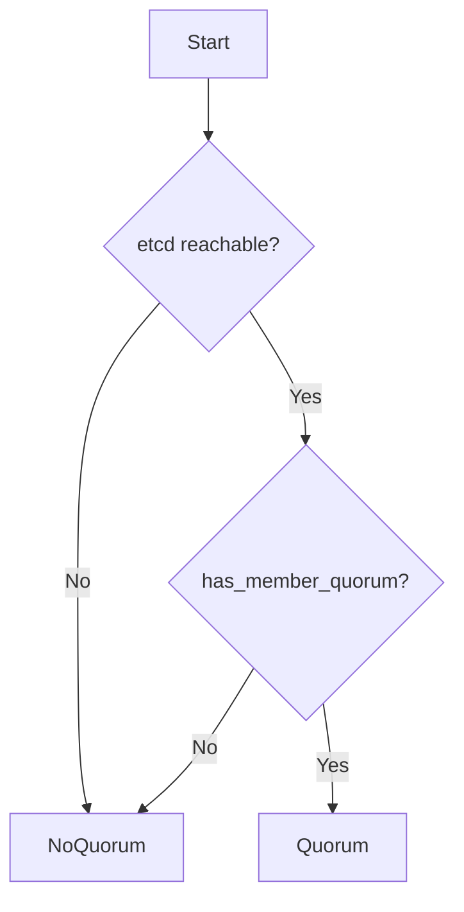

# Trust Model and DCS Coordination Modes

The current DCS trust model is intentionally binary at the public boundary. A node either has quorum and may publish authoritative cluster data, or it does not and must withhold that data.

## DCS modes

The public DCS snapshot in `src/dcs/state.rs` uses exactly two variants:

- **Quorum**: the node can publish authoritative DCS membership, leadership, and switchover state
- **NoQuorum**: the node must not publish that cluster payload

This is a change from the older three-state explanations that described separate degraded and not-trusted public modes. Today those distinctions are not modeled as separate public DCS variants.

```mermaid
graph TD
    A[Start] --> B{etcd reachable?}
    B -->|No| C[NoQuorum]
    B -->|Yes| D{has_member_quorum?}
    D -->|No| C
    D -->|Yes| E[Quorum]
```

## How the mode is chosen

`current_snapshot(...)` publishes:

- `NoQuorum` when etcd is unreachable
- `NoQuorum` when `has_member_quorum(...)` is false
- `Quorum(...)` otherwise

The current member-count rule is minimal rather than majority-based:

- 0 members -> no quorum
- 1 member -> quorum
- 2 or more members -> require at least 2 members

This is the rule that decides whether the public DCS surface may expose cluster data at all.

## What changes at the boundary

When the snapshot is `Quorum`, the public DCS view contains:

- members
- leadership
- switchover state

When the snapshot is `NoQuorum`, those public accessors yield no cluster payload:

- no members
- no leadership
- no switchover

That is the important safety property for this codebase: loss of authority withdraws public topology instead of exposing stale observations.

## HA behavior

The HA engine mirrors the same binary split with `CoordinationState::NoQuorum` and `CoordinationState::Quorum(...)`.

When DCS falls to `NoQuorum`, HA does not continue ordinary leadership behavior. Instead it:

- withdraws the operator-visible primary
- routes into fail-safe behavior
- keeps primaries from remaining authoritatively writable without quorum

This is why user-facing command health may become degraded even though the DCS ADT itself is now only `quorum` or `no_quorum`.

## Practical example: DCS quorum loss

The HA scenario `ha_dcs_quorum_lost_enters_failsafe` demonstrates the intended result:

1. A healthy cluster starts with one stable primary.
2. A DCS quorum majority is stopped.
3. The operator-visible primary disappears.
4. Running nodes report fail-safe behavior.
5. Quorum returns.
6. One stable authoritative primary returns.

The system chooses to withdraw authority rather than preserve stale cluster visibility through the outage.

## Design rationale

This model makes the public contract simpler and safer:

- quorum means the published DCS payload is authoritative
- no quorum means the payload is withheld

More detailed failure causes still exist in logs, worker state, and higher-level warnings, but they do not appear as separate public DCS topology modes.
