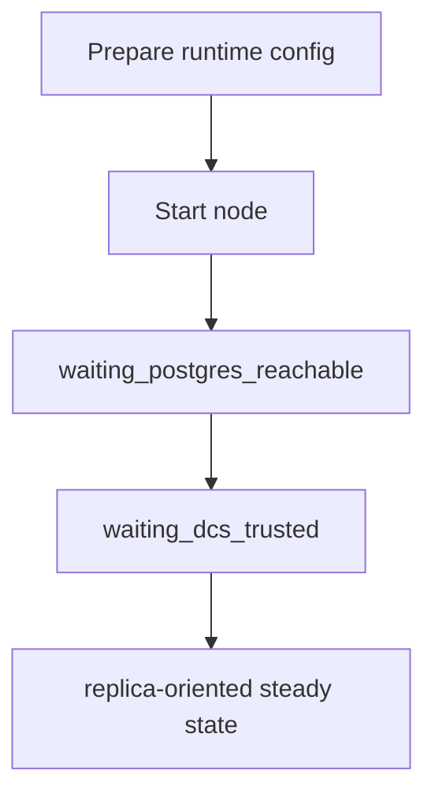

# Add a Cluster Node

This guide shows how to add a new node to an existing cluster and verify that it joins safely.

## Goal

Bring up a new node that:

- uses the same cluster identity and DCS scope as the existing cluster
- publishes its own member record
- converges into expected replica behavior when a healthy primary already exists

## Prerequisites

- a running cluster with a known `cluster.name` and `dcs.scope`
- PostgreSQL 16 binaries installed on the new node
- valid runtime-config paths for PostgreSQL data, socket, and logs
- network reachability to the cluster's DCS endpoints
- network reachability to the relevant PostgreSQL endpoints in the cluster

## Step 1: Prepare a runtime config for the new node

Use an existing runtime config as your starting point and change the node-specific identity and addresses.

The docker example at `docker/configs/cluster/node-a/runtime.toml` shows the full shape.

Fields that must be correct for the new node:

- `cluster.name`
- `cluster.member_id`
- `postgres.listen_host`
- `postgres.listen_port`
- `dcs.endpoints`
- `dcs.scope`
- `process.binaries.*`
- `api.listen_addr`

The new node must use:

- the same `cluster.name` as the rest of the cluster
- a unique `cluster.member_id`
- the same DCS scope and endpoints as the rest of the cluster

## Step 2: Check connectivity before you start it

Before starting the new node, verify:

- it can reach the configured DCS endpoints
- the relevant PostgreSQL listen address and port are reachable in your environment

The DCS member model includes `postgres_host` and `postgres_port`, so PostgreSQL network reachability is part of normal follow and recovery behavior.

## Step 3: Start the node with the prepared config

Start pgtuskmaster using your normal service method for this environment.

The node starts from the HA phase machine defined in the runtime:

- `init`
- `waiting_postgres_reachable`
- `waiting_dcs_trusted`

From there, the next phase depends on the observed world state.

## Step 4: Watch the node's HA state

Poll the new node directly:

```bash
curl --fail --silent http://127.0.0.1:8080/ha/state | jq .
```

Or use the CLI:

```bash
pgtm -c /etc/pgtuskmaster/config.toml --output json status
```

Watch these fields:

- `self_member_id`
- `leader`
- `member_count`
- `dcs_trust`
- `ha_phase`
- `ha_decision`

When a healthy primary already exists, the usual steady-state goal is replica behavior rather than leadership.

## Step 5: Verify that the node is joining the existing topology

For a normal join into a healthy cluster, look for:

- trusted DCS state
- a visible leader
- the new node settling into replica-oriented behavior

In practice that means:

- `dcs_trust` reaches `full_quorum`
- `leader` is populated and agrees with the rest of the cluster
- `ha_phase` stops moving through startup transitions
- `ha_decision` stops showing startup or recovery churn

If you also inspect DCS directly with your environment's store tooling, look for the new node's member record under the cluster scope. The internal member record model includes:

- `member_id`
- `postgres_host`
- `postgres_port`
- `role`
- `sql`
- `readiness`
- `timeline`
- WAL position fields

## Step 6: Verify the node behaves like a replica

Use PostgreSQL-level checks that fit your environment to confirm the new node is following the current primary.

The exact SQL and access path depend on your deployment, but the goal is:

- the new node is not acting as a second primary
- the new node can follow the current leader
- fresh writes on the primary become visible after replication catches up

## Step 7: Compare more than one node before you declare success

Sample `GET /ha/state` on multiple nodes:

```bash
for node in node-a node-b node-c; do
  curl --fail --silent "http://${node}:8080/ha/state" | jq -r '"\(.self_member_id) leader=\(.leader // "none") trust=\(.dcs_trust) phase=\(.ha_phase) decision=\(.ha_decision.kind)"'
done
```

You want:

- agreement on the same leader
- no sustained dual-primary evidence
- no node stuck in `fail_safe`
- the new node no longer bouncing through startup transitions

## Troubleshooting

### The node stays in `waiting_postgres_reachable`

Check:

- local PostgreSQL startup
- `process.binaries.*`
- PostgreSQL data, socket, and log paths

### The node stays in `waiting_dcs_trusted` or enters `fail_safe`

Check:

- DCS endpoint reachability
- DCS scope correctness
- whether the node can publish fresh membership

### The node attempts leadership unexpectedly

Check:

- whether the existing primary is still visible and healthy
- whether the cluster is suffering a trust or freshness problem
- whether the new node was started against the correct scope and endpoints

## Diagram


