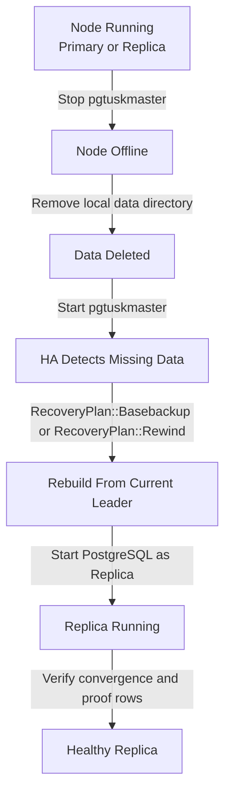

# How to Perform Backup and Restore Operations

This guide shows you how to manage PostgreSQL backups and restore nodes in a pgtuskmaster cluster. It covers PostgreSQL-native backup creation and safe cluster reintegration patterns.

## Prerequisites

You must have:

- A running pgtuskmaster cluster with at least one primary node
- Direct access to PostgreSQL binaries on each node
- Configured `replicator` and `rewinder` roles in your pgtuskmaster configuration
- TLS certificates properly configured for client connections if using VERIFY-FULL mode
- Sufficient disk space for backup storage on your chosen backup host

## Create a Physical Backup

Pgtuskmaster does not provide built-in backup scheduling. Use PostgreSQL native tools directly.

### Create a Base Backup from the Primary

Connect to the authoritative primary node and run:

```bash
pg_basebackup -h localhost -U replicator -D /path/to/backup/dir -Ft -z -P -X stream
```

The `-X stream` option includes WAL files necessary for consistency.

### Important Configuration

Your pgtuskmaster configuration must expose the `pg_basebackup` binary:

```toml
[process.binaries]
pg_basebackup = "/usr/lib/postgresql/16/bin/pg_basebackup"
```

If using TLS with VERIFY-FULL mode for `pg_rewind` operations, include CA certificate configuration in `postgres.rewind.transport.ca_cert`.

## Restore a Node from Backup

Pgtuskmaster's restore-like behavior focuses on safe node reintegration, not in-place primary restoration.

### Step 1: Take the Target Node Offline

Stop the pgtuskmaster service on the target node. This prevents unsafe promotion during restore.

### Step 2: Remove Existing Data Directory

Wipe the PostgreSQL data directory to ensure a clean restore:

```bash
rm -rf /var/lib/postgresql/data/*
```

Warning: this permanently deletes local data. Verify you have a working backup before proceeding.

### Step 3: Let Pgtuskmaster Rebuild the Replica

Start the pgtuskmaster service. The HA reconciliation automatically detects the missing data directory and triggers replica provisioning:

```bash
systemctl start pgtuskmaster
```

Pgtuskmaster selects a recovery method based on cluster state:

- Basebackup: used when the node has no local data or the timeline is too far diverged
- PgRewind: used when the node was previously a primary and can be repaired

The recovery plan is defined in the `RecoveryPlan` enum in the HA types.

### Step 4: Wait for Rejoin and Convergence

Monitor node status until it reports as a healthy replica:

```bash
pgtm -c config.toml status
```

Wait until the replica reports as healthy and replication is active before considering the operation complete.

### Step 5: Verify Data Convergence

Insert test data through the primary and confirm it appears on the restored replica:

```bash
psql -h primary-host -U postgres -c "CREATE TABLE verify_restore(id int); INSERT INTO verify_restore values (1);"
psql -h restored-node-host -U postgres -c "SELECT * FROM verify_restore;"
```

The data must appear on the restored replica before the node is considered fully reintegrated.

## Important Safety Constraints

Never restore a node to primary authority directly from backup. The repository provides no API or reconciliation path for this. A restored node must rejoin as a replica first, allowing the HA system to establish a single authoritative primary.

Do not attempt to bypass replica recovery. The test suite explicitly validates that nodes with missing or inconsistent data cannot become primary until after successful replica reintegration. The scenario `ha_basebackup_clone_blocked_then_unblocked_replica_recovers.feature` demonstrates this safety pattern.

Backup retention and scheduling are operator responsibilities. The codebase does not include backup retention policies, archive command orchestration, or scheduled job execution. Configure these through external tooling.

## Configuration Reference

Minimum required configuration for restore operations:

```toml
[postgres.roles.mandatory.replicator]
username = "replicator"
auth = { type = "password", password = { path = "/etc/pgtuskmaster/secrets/replicator-password" } }

[postgres.roles.mandatory.rewinder]
username = "rewinder"
auth = { type = "password", password = { path = "/etc/pgtuskmaster/secrets/rewinder-password" } }

[process.timeouts]
bootstrap_ms = 300000
pg_rewind_ms = 120000
```



For complete configuration options, see [Runtime Configuration](../reference/runtime-configuration.md).
