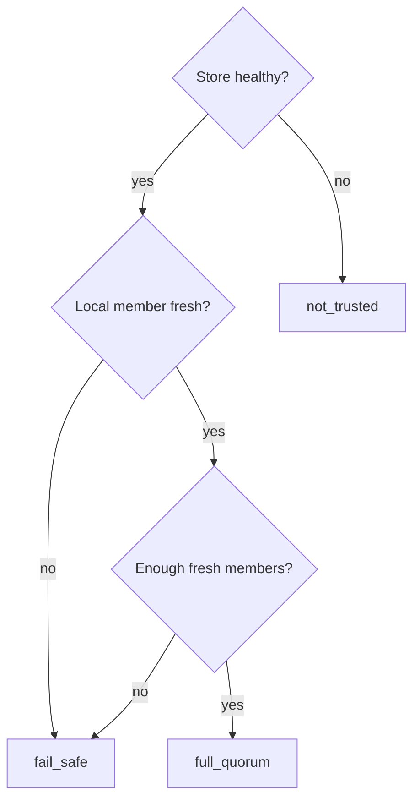

# Handle Complex Failures

This guide shows how to respond when the cluster is dealing with more than one simple failure at a time, such as quorum loss, a majority/minority partition, mixed network-path faults, or a rejoin that does not converge cleanly. Use `pgtm` first and raw debug surfaces only when the cluster-wide view is not enough.

## Goal

Determine:

- whether the cluster still has a trustworthy DCS view
- whether `pgtm` can still form an authoritative primary answer
- whether the system is converging automatically or has stopped at a safety boundary

For ordinary failover after a simple primary loss, see [Handle Primary Failure](handle-primary-failure.md). For partition-specific procedures, see [Handle a Network Partition](handle-network-partition.md). For low-level diagnosis, see [Debug Cluster Issues](debug-cluster-issues.md).

## Step 1: Start with `pgtm status -v` from more than one seed

Run the same cluster summary from each operator seed you can still reach:

```bash
pgtm -c /etc/pgtuskmaster/node-a.toml status -v
pgtm -c /etc/pgtuskmaster/node-b.toml status -v
pgtm -c /etc/pgtuskmaster/node-c.toml status -v
```

Focus on:

- `TRUST`
- `LEADER`
- `PHASE`
- `DECISION`
- warning lines such as sampling failures or disagreement

`pgtm primary` is intentionally strict. It fails closed when it cannot form an authoritative write-target answer, including:

- no sampled primary
- multiple sampled primaries
- incomplete peer sampling
- leader or membership disagreement across sampled nodes

That means "no answer" is often the correct safety signal during a complex fault.

## Step 2: Interpret the trust state first

The runtime evaluates DCS trust before ordinary HA actions. In `src/dcs/state.rs`, trust is:

- `full_quorum` when the backing store is healthy, the local member is fresh, and the observed cache still has enough fresh members
- `fail_safe` when the store is reachable but the node does not have a fresh enough view for normal coordination
- `not_trusted` when the backing store itself is unhealthy

In the Docker cluster config used by the greenfield HA suite:

- `loop_interval_ms = 1000`
- `lease_ttl_ms = 10000`

Operationally, that means trust and leader freshness are bounded by the lease TTL and the HA loop cadence, not by a single packet-loss event.



## Step 3: Know what degraded trust does to HA behavior

At the top of `src/ha/decide.rs`, the HA decision engine checks trust before phase-specific logic:

- if trust is not `FullQuorum` and local PostgreSQL is primary, the node enters `FailSafe` with `EnterFailSafe { release_leader_lease: false }`
- if trust is not `FullQuorum` and local PostgreSQL is not primary, the node still moves into `FailSafe`, but with `NoChange`

This is the core safety rule for complex failures:

- the system prefers safety over availability when it cannot trust the cluster view
- operators should restore trust before expecting normal leader movement
- manual PostgreSQL promotion is the wrong reaction while trust is degraded

## Step 4: Classify the failure by operator-visible signals

The advanced greenfield HA wrappers exercise the same kinds of situations operators need to reason about:

- majority survives but the old primary is isolated
- DCS quorum is lost while writes are in flight
- mixed API, DCS, and postgres-path faults overlap
- a restarted or recovering node remains `unknown` instead of converging

Treat these signals as meaningful:

- `leader_mismatch`
- `insufficient_sampling`
- `unreachable_node`
- sustained `fail_safe` or `not_trusted`
- `pgtm primary` still returning a target during a no-quorum condition
- `pgtm primary` continuing to fail closed even after the majority should be healthy again

Good signs:

- all reachable seed configs converge on the same leader
- warnings disappear
- `pgtm primary` returns one target cleanly
- restarted members settle back into replica behavior

Bad signs:

- different seeds disagree for longer than one `lease_ttl_ms` plus a few HA loops
- a no-quorum condition still exposes an operator-visible primary
- the majority side remains observable but no sampled primary ever emerges
- a restarted node keeps cycling through `unknown`, `fail_safe`, or repeated rejoin attempts

## Step 5: Decide whether to wait or investigate

Wait and keep observing when:

- the fault is recent and still inside the expected lease-expiry window
- warnings are decreasing as connectivity returns
- a restarted replica is clearly progressing toward normal follower behavior

Move into manual investigation when:

- `pgtm primary` is still failed closed after the cluster should have had time to refresh its leases and member records
- `pgtm primary` still returns a target during a no-quorum scenario
- `leader_mismatch`, `insufficient_sampling`, or trust degradation remain steady instead of converging
- the same node stays unhealthy across repeated `pgtm status -v` samples from multiple seeds

The important distinction is this:

- waiting is appropriate while the cluster is still inside its safety window
- investigation is appropriate when the cluster has stopped moving toward a trustworthy answer

## Step 6: Restore trust before authority

If the cluster is in `not_trusted` or `fail_safe`, restore the trust inputs first.

If the backing store is unhealthy:

- repair etcd health or connectivity
- wait for fresh member publication to resume
- re-run `pgtm status -v` until trust returns to `full_quorum`

If the store is healthy but the cluster lacks fresh quorum:

- identify which members are stale or unreachable
- restore the missing network paths or node availability
- confirm that at least two members in the multi-member view are fresh again

Do not try to solve a trust problem with manual `pg_ctl promote`, ad hoc DCS edits, or a full-cluster restart. Those actions bypass the exact safety boundaries the runtime is trying to preserve.

## Step 7: Inspect one node when the cluster table is not enough

When the cluster-wide view is contradictory or stalled, inspect a single node with the stable debug surface:

```bash
pgtm -c /etc/pgtuskmaster/node-a.toml debug verbose
```

Focus on:

- `dcs.trust`
- `dcs.leader`
- `ha.phase`
- `ha.decision`
- `process.state`
- recent change and timeline entries

Use this to answer:

- is the node still waiting for DCS trust?
- is it fencing after seeing a foreign leader?
- is it repeatedly attempting recovery without converging?

If you need the raw unstable snapshot surface for deeper incident capture, use the documented `/debug/snapshot` endpoint from the Debug API reference rather than inventing a manual recovery action from partial evidence.

## Step 8: Verify convergence after the fault is healed

After connectivity or member freshness is restored, keep polling until:

- trust returns to `full_quorum`
- all reachable seeds agree on one leader
- `pgtm primary` returns one target cleanly
- no member remains stuck in `fail_safe` or `unknown`

For the most complex cases, do not stop at HA labels alone. Also verify that replicas have actually resumed follower behavior and that recent writes have converged again.

## What Not to Do

During complex failures, do not:

- manually promote PostgreSQL
- delete leader or member keys to "unstick" the cluster
- restart every node at once
- treat a lone local view as authoritative when other seeds disagree

The CLI is intentionally conservative. Respect the conservative answer.

## Summary

Complex failures are trust-restoration problems first and leader-restoration problems second. Start with `pgtm status -v` from multiple seeds, trust a failed-closed `pgtm primary` more than a convenient guess, restore DCS and member freshness before touching authority, and investigate only when the cluster stops converging toward a single trustworthy answer.
