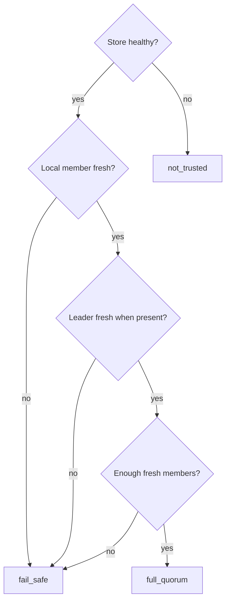

# Handle a Network Partition

This guide shows how to detect, monitor, and recover from a network partition with `pgtm` first and raw HTTP only when you need to inspect the protocol directly.

## Goal

Determine:

- whether trust has degraded
- whether the nodes still agree on a single leader
- whether the cluster has converged again after the fault is healed

## Prerequisites

- access to the API listener on each node
- `pgtm`
- `jq` if you want to script against CLI JSON output

## Step 1: Check trust and leader agreement on every node

Start with the same verbose cluster summary from each seed node:

```bash
for node in node-a node-b node-c; do
  pgtm --base-url "http://${node}:8080" -v status
done
```

Focus on:

- `TRUST`
- `LEADER`
- `PHASE`
- `DECISION`
- `DEBUG`
- warning lines about peer sampling failures

If you want a script-friendly summary, use JSON:

```bash
for node in node-a node-b node-c; do
  pgtm --base-url "http://${node}:8080" --json status | jq -r '
    .queried_via.member_id as $seed
    | .nodes[]
    | select(.is_self)
    | "\($seed) trust=\(.trust) leader=\(.leader // "none") phase=\(.phase)"'
done
```

Trust values are:

- `full_quorum`
- `fail_safe`
- `not_trusted`

Operationally:

- `full_quorum` means the node has a fresh enough cluster view for normal HA behavior
- `fail_safe` means the store is reachable but freshness or coverage is not good enough for normal coordination
- `not_trusted` means the store itself is unhealthy or unreachable from that node

Treat any sustained disagreement about `leader` or any sustained view with more than one sampled primary as critical.

## Step 2: Understand what the trust gate is doing

Trust evaluation is based on:

- backing-store health
- presence of the local member record
- freshness of the local member record
- freshness of the leader record when a leader exists
- the count of fresh members when the cache contains more than one member

Freshness is checked against `ha.lease_ttl_ms`. The docker example configuration uses:

- `loop_interval_ms = 1000`
- `lease_ttl_ms = 10000`

That means trust transitions are bounded by publish cadence and lease TTL, not by a single instantaneous packet loss.



## Step 3: Inspect the affected node with `pgtm debug verbose`

When the cluster table is not enough, inspect the specific node that looks partitioned:

```bash
pgtm --base-url http://node-a:8080 debug verbose
```

Focus on:

- `dcs.trust`
- `dcs.leader`
- `ha.phase`
- `ha.decision`
- `process.state`
- recent `changes`
- recent `timeline`

For repeated polling during the incident, use the retained sequence cursor:

```bash
last_seq=$(pgtm --base-url http://node-a:8080 --json debug verbose | jq '.meta.sequence')
pgtm --base-url http://node-a:8080 --json debug verbose --since "${last_seq}" | jq '{
  sequence: .meta.sequence,
  changes: .changes,
  timeline: .timeline
}'
```

If the CLI reports `debug=disabled`, `auth_failed`, or `transport_failed` in `status -v`, fix that access problem before you assume the node has no interesting history.

## Step 4: Interpret fail-safe behavior carefully

When trust is not `FullQuorum`, the node routes into `FailSafe`.

- If local PostgreSQL is primary at that moment, the decision becomes `enter_fail_safe`
- If local PostgreSQL is not primary, the node enters `fail_safe` with `no_change`

The lowered effect plan for `enter_fail_safe` includes the safety effect for fencing, and may also release the leader lease when `release_leader_lease` is true.

Do not assume that a partitioned node should be forced back into service manually while trust is degraded. The system is intentionally conservative here.

## Step 5: Heal the fault

Restore the failed network path:

- repair connectivity to the DCS endpoints
- remove proxy, firewall, or routing blocks
- restore the node-to-node paths your environment requires

The partition tests in this repo exercise several distinct cases:

- a node isolated from etcd
- the primary isolated from etcd
- API-path isolation
- mixed network faults followed by healing

That distinction matters operationally. Diagnose which path failed before assuming the cluster needs the same recovery steps every time.

## Step 6: Wait for convergence after healing

After the fault is removed, keep polling all nodes until:

- trust returns to `full_quorum`
- the nodes agree on a single leader
- replicas settle back into expected follower behavior
- no node remains stuck in `fail_safe`

```bash
for node in node-a node-b node-c; do
  pgtm --base-url "http://${node}:8080" --json status | jq -r '
    .queried_via.member_id as $seed
    | .nodes[]
    | select(.is_self)
    | "\($seed) trust=\(.trust) leader=\(.leader // "none") phase=\(.phase) decision=\(.decision // "unknown")"'
done
```

## Step 7: Verify replication again

Once HA state looks stable, verify that replicas have actually converged.

This guide cannot prescribe one exact SQL verification command for every deployment, but the goal is straightforward:

- confirm there is one stable primary
- confirm replicas are back in replica behavior
- confirm recent writes from the primary are visible after replication catches up

## Quick checklist

- `dcs_trust` is back to `full_quorum` on every node
- every node reports the same `leader`
- only one node reports `ha_phase = "primary"`
- replicas are no longer stuck in `fail_safe`
- `changes` and `timeline` no longer show ongoing trust churn
