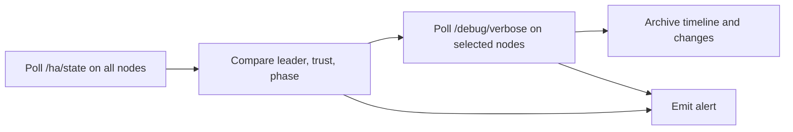

# Monitor via API and CLI Signals

This guide shows how to monitor a running cluster using the JSON observation surfaces that pgtuskmaster already exposes.

At the time of writing, the source-backed observability surfaces in this repo are JSON API and CLI outputs rather than a dedicated Prometheus or StatsD exporter.

## Goal

Track:

- leader changes
- trust degradation
- fail-safe entry
- recovery and fencing activity
- recent state-change history

## Prerequisites

- access to each node's API listener
- `curl` and `jq`
- optional: `pgtuskmasterctl`
- `[debug] enabled = true` on the nodes you want to poll with `/debug/verbose`

## Step 1: Poll `GET /ha/state` on every node

Use the lightweight HA summary first.

```bash
for node in node-a node-b node-c; do
  curl --fail --silent "http://${node}:8080/ha/state" | jq .
done
```

The response includes:

- `leader`
- `member_count`
- `dcs_trust`
- `ha_phase`
- `ha_tick`
- `ha_decision`
- `snapshot_sequence`

Focus on these signals:

- `leader`: change means failover or switchover
- `dcs_trust`: `fail_safe` or `not_trusted` means degraded coordination safety
- `ha_phase`: `fail_safe`, `rewinding`, `bootstrapping`, or `fencing` are high-signal operational states
- `ha_decision.kind`: `step_down`, `recover_replica`, `fence_node`, `release_leader_lease`, and `enter_fail_safe` all deserve attention

## Step 2: Use `pgtuskmasterctl` for the same state

The CLI wraps the same `GET /ha/state` API:

```bash
pgtuskmasterctl --base-url http://127.0.0.1:8080 --output json ha state
```

Use text output when you want a compact shell-friendly view:

```bash
pgtuskmasterctl --base-url http://127.0.0.1:8080 --output text ha state
```

## Step 3: Collect rich state with `/debug/verbose`

`/debug/verbose` is the structured debug surface. It returns:

- `meta`
- `config`
- `pginfo`
- `dcs`
- `process`
- `ha`
- `api`
- `debug`
- `changes`
- `timeline`

Example:

```bash
curl --fail --silent http://127.0.0.1:8080/debug/verbose | jq .
```

Use it when you need more than the coarse HA summary:

- PostgreSQL role and readiness via `pginfo`
- DCS trust and leader cache via `dcs`
- background job activity via `process`
- decision detail and planned action count via `ha`

## Step 4: Poll incrementally with `since`

The debug endpoint supports incremental history polling.

```bash
last_seq=$(curl --fail --silent http://127.0.0.1:8080/debug/verbose | jq '.meta.sequence')
curl --fail --silent "http://127.0.0.1:8080/debug/verbose?since=${last_seq}" | jq .
```

Use these fields to manage your poller:

- `meta.sequence`
- `debug.last_sequence`
- `debug.history_changes`
- `debug.history_timeline`

The current in-memory retention limit is 300 entries for `changes` and `timeline`, so incremental polling is the safest way to keep event history without missing rollovers.

## Step 5: Alert on leader and trust anomalies

Sample all nodes repeatedly and compare them.

### Leader disagreement

```bash
for node in node-a node-b node-c; do
  curl --fail --silent "http://${node}:8080/ha/state" | jq -r '"\(.self_member_id) leader=\(.leader // "none") phase=\(.ha_phase)"'
done
```

Alert if nodes disagree for more than a brief transition window.

### Dual-primary evidence

```bash
primary_count=0
for node in node-a node-b node-c; do
  phase=$(curl --fail --silent "http://${node}:8080/ha/state" | jq -r '.ha_phase')
  if [ "${phase}" = "primary" ]; then
    primary_count=$((primary_count + 1))
  fi
done
printf 'primary_count=%s\n' "${primary_count}"
```

Treat any sustained value greater than `1` as critical. The HA observer used in tests treats more than one sampled primary as a split-brain condition.

### Trust degradation

```bash
for node in node-a node-b node-c; do
  curl --fail --silent "http://${node}:8080/ha/state" | jq -r '"\(.self_member_id) trust=\(.dcs_trust)"'
done
```

Alert when any node reports:

- `fail_safe`
- `not_trusted`

## Step 6: Watch decision kinds, not only phases

`ha_phase` tells you where the node is. `ha_decision` tells you what it wants to do next.

Useful decision kinds to alert on:

- `enter_fail_safe`
- `fence_node`
- `release_leader_lease`
- `step_down`
- `recover_replica`

Example:

```bash
curl --fail --silent http://127.0.0.1:8080/ha/state | jq '.ha_decision'
```

## Step 7: Archive recent history during incidents

When an incident starts, capture the debug payloads for later analysis.

```bash
stamp=$(date -u +%Y%m%dT%H%M%SZ)
curl --fail --silent http://127.0.0.1:8080/debug/verbose > "/var/log/pgtuskmaster/debug-${stamp}.json"
```

The `timeline` and `changes` sections are especially useful for reconstructing:

- when trust degraded
- when leadership changed
- when recovery started
- when fencing or fail-safe behavior appeared

## Monitoring pattern


