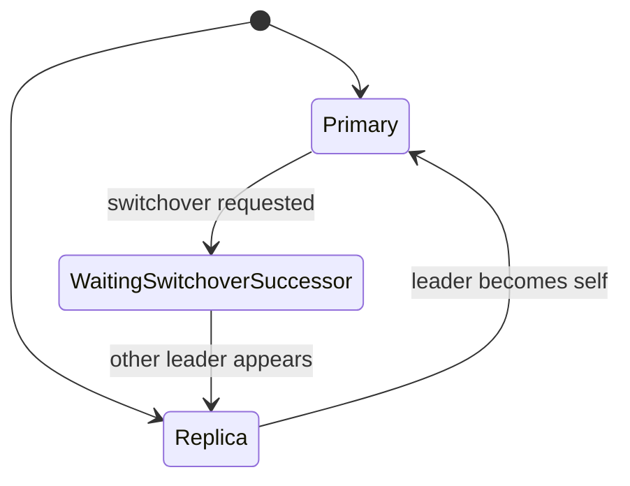

# Perform a Planned Switchover

This guide shows how to transfer primary leadership to another cluster member without stopping the cluster.

## Before you begin

Verify the cluster is healthy:

```bash
pgtm -c /etc/pgtuskmaster/config.toml
```

The steady-state goal before a planned switchover is:

- one sampled primary
- replicas visible as replicas
- `health: healthy`
- no warning lines
- `TRUST=full_quorum` across sampled nodes

Identify the relevant member IDs:

```bash
pgtm -c /etc/pgtuskmaster/config.toml --json
```

Use the cluster view to confirm:

- the current primary
- the replica you want to target, if any
- whether a switchover is already pending
- whether any node is unreachable or not publishing a peer API URL

## Submit the switchover request

Run the request from the shared runtime config that already names an operator-reachable API URL and auth settings:

```bash
pgtm -c /etc/pgtuskmaster/config.toml switchover request
```

For a targeted switchover, add the optional member flag:

```bash
pgtm -c /etc/pgtuskmaster/config.toml switchover request --switchover-to node-b
```

The generic form records pending switchover intent and lets the runtime choose the successor automatically. The targeted form is accepted only when `node-b` is a known, eligible replica. When API role tokens are enabled, `pgtm` resolves the admin token from the shared config and any referenced secret sources.

Without `--json`, a successful request returns:

```text
accepted=true
```

With `--json`, the same success is:

```text
{
  "accepted": true
}
```

`[pgtm].api_url` should point to a reachable node API. If you need to target another node temporarily, use `--base-url` as an explicit override for that one command.

## Monitor the transition

Use the cluster-wide status command while the switchover is in progress:

```bash
pgtm -c /etc/pgtuskmaster/config.toml status --watch
```

If you want structured output for automation, use:

```bash
pgtm -c /etc/pgtuskmaster/config.toml status --watch --json
```

Observe these source-backed state changes:

1. A `switchover: pending -> ...` line appears while the request is still in force.
2. The current primary moves through `waiting_switchover_successor`.
3. A different node becomes the sampled primary.
4. The former primary converges back to replica behavior.
5. The pending switchover marker disappears after the transition settles.

Generic successor selection is automatic. The HA engine chooses the next primary from observed cluster state and healthy follow targets when no target is supplied. For a targeted switchover, the HA engine keeps non-target nodes from acquiring leadership and waits for the requested eligible replica to take over.

The transition is complete when cluster-wide status shows:

- exactly one sampled primary
- `health: healthy`
- no warnings
- no pending switchover line

## Verify the new primary

Run one cluster-wide check instead of manually comparing raw per-node API responses:

```bash
pgtm -c /etc/pgtuskmaster/config.toml status -v
```

Confirm that:

- the table shows exactly one sampled primary
- replicas have converged on replica behavior
- no node reports degraded trust
- no warning lines remain
- `API=ok` for the members you expect to be reachable

If you want the concrete PostgreSQL target without scraping the status table, resolve it directly:

```bash
pgtm -c /etc/pgtuskmaster/config.toml primary
```

That output is designed to feed straight into `psql`:

```bash
psql "$(pgtm -c /etc/pgtuskmaster/config.toml primary)" -c "SELECT pg_is_in_recovery();"
```

`f` means the server is acting as primary.

To inspect the currently sampled read targets after the switchover settles:

```bash
pgtm -c /etc/pgtuskmaster/config.toml replicas
```

## Clear a pending switchover request

The successful primary step-down path clears the switchover marker automatically. The manual clear command is still available when you need to remove a pending switchover request:

```bash
pgtm -c /etc/pgtuskmaster/config.toml switchover clear
```

Without `--json`, a successful clear returns:

```text
accepted=true
```

## Troubleshooting

### Request fails with a transport error

Retry the same command with a different `--base-url` that points to another reachable node API.

### Status stays degraded during the switchover

Check the warnings in cluster status first:

```bash
pgtm -c /etc/pgtuskmaster/config.toml status
```

The normal switchover path depends on `full_quorum` DCS trust and enough peer API reachability to form a confident cluster view. If trust has fallen to `fail_safe` or `not_trusted`, or if nodes are unreachable, resolve cluster and DCS health first.

### Transition stalls in `waiting_switchover_successor`

Use verbose status to see deeper per-node detail:

```bash
pgtm -c /etc/pgtuskmaster/config.toml status -v
```

Look for:

- degraded trust
- unreachable nodes
- a target replica that is not healthy enough to take over
- disagreement about who the leader is

### Multiple primaries appear in status

Treat that as an immediate incident. Recheck cluster-wide status, inspect DCS connectivity, and verify PostgreSQL reachability before continuing operator actions.

## State Transition Diagram


