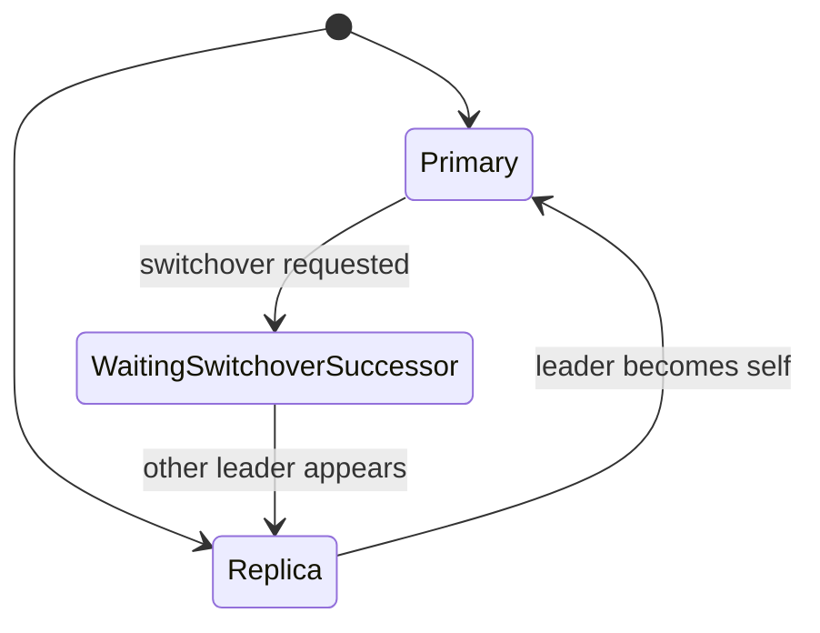

# Perform a Planned Switchover

This guide shows how to transfer primary leadership to another cluster member without stopping the cluster.

## Before you begin

Verify cluster state is healthy:

```bash
pgtuskmasterctl ha state
```

Expected output shows `dcs_trust` as `full_quorum`. If trust is `fail_safe` or `not_trusted`, resolve DCS health before proceeding.

Identify the relevant member IDs:

```bash
pgtuskmasterctl ha state
```

The API response includes `self_member_id`, `leader`, `switchover_pending`, and `switchover_to`. Use those fields to confirm the current primary, whether a switchover request is already pending, and whether the pending request is generic or targeted.

## Submit the switchover request

Run the request against a node API endpoint that can accept admin requests:

```bash
pgtuskmasterctl --base-url http://127.0.0.1:18081 ha switchover request
```

For a targeted switchover, add the optional member flag:

```bash
pgtuskmasterctl --base-url http://127.0.0.1:18081 ha switchover request --switchover-to node-b
```

The generic form records pending switchover intent and lets the runtime choose the successor automatically. The targeted form is accepted only when `node-b` is a known, eligible replica. If API role tokens are enabled in your deployment, add `--admin-token "$PGTUSKMASTER_ADMIN_TOKEN"` or set `PGTUSKMASTER_ADMIN_TOKEN` in the environment because switchover requests are admin operations. A successful request returns:

```text
{"accepted": true}
```

The shipped CLI sends the request to exactly the `--base-url` you provide. If the request fails against one node, target another node manually.

## Monitor the transition

Poll HA state while the switchover is in progress:

```bash
watch -n 2 'pgtuskmasterctl --base-url http://127.0.0.1:18081 ha state | jq .'
```

Observe these source-backed state changes:

1. The current primary moves from `ha_phase=primary` to `ha_phase=waiting_switchover_successor`.
2. The current primary reports a `ha_decision.kind` of `step_down` while processing the switchover path.
3. After a different leader appears, the former primary converges back to replica behavior and follows the new leader.
4. The new primary reports `ha_phase=primary`, and the `leader` field changes to that member ID.

Generic successor selection is automatic. The HA engine chooses the next primary from observed cluster state and healthy follow targets when no target is supplied. For a targeted switchover, the HA engine keeps non-target nodes from acquiring leadership and waits for the requested eligible replica to take over.

The transition is complete when `/ha/state` shows one primary and the other nodes have converged on follower behavior.

## Verify the new primary

Use `/ha/state` on more than one node and compare the results:

- confirm all nodes agree on the same `leader`
- confirm only one node reports `ha_phase=primary`
- confirm `switchover_pending=false` after the transition settles
- confirm `switchover_to=null` or `switchover_to=<none>` after the transition settles

If you also want a PostgreSQL-level confirmation, connect to the suspected new primary and run:

```bash
psql -h new-primary-host -p 5432 -U postgres -d postgres -c "SELECT pg_is_in_recovery();"
```

`f` means the server is acting as primary.

## Clear a pending switchover request

The successful primary step-down path clears the switchover marker automatically. The manual clear command is still available when you need to remove a pending switchover request:

```bash
pgtuskmasterctl --base-url http://127.0.0.1:18081 ha switchover clear
```

If API role tokens are enabled, the clear operation also requires the admin token path described above.

A successful clear returns:

```text
{"accepted": true}
```

## Troubleshooting

### Request fails with a transport error

The CLI does not retry across nodes automatically. Retry the same command with a different `--base-url` that points to another reachable node API.

### Transition stalls in `waiting_switchover_successor`

Check the affected nodes with:

```bash
pgtuskmasterctl --base-url http://127.0.0.1:18081 ha state | jq '.dcs_trust, .ha_phase'
```

The normal switchover path depends on `full_quorum` DCS trust. If trust has fallen to `fail_safe` or `not_trusted`, resolve cluster and DCS health first.

### Multiple primaries appear in observation

Treat that as an immediate incident. Recheck `/ha/state` across all nodes, inspect DCS connectivity, and verify PostgreSQL reachability before continuing operator actions.

## State Transition Diagram


