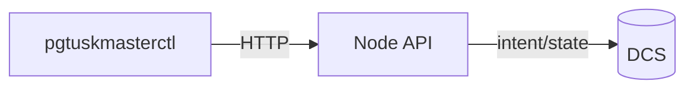

# CLI Workflows

`pgtuskmasterctl` is a convenience interface for the node API.

The CLI is designed to support operator workflows such as:
- “show me the current HA state”
- “request a switchover”
- “cancel a pending switchover”



Example (orientation only):

```console
# Inspect HA state (read-only)
pgtuskmasterctl ha state
```

