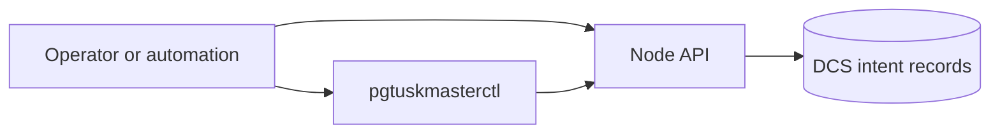

# Interfaces

Interfaces are the operator contract surfaces for control and observation.

There are two interaction modes:

- Observe current HA state and trust posture.
- Submit or cancel planned transition intent.

Use this section when you need concrete endpoint and CLI workflow behavior.
