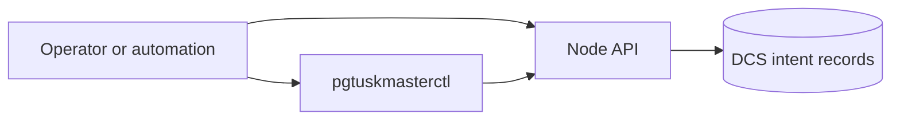

# Interfaces

Interfaces are the operator contract surfaces for control and observation.

There are two interaction modes:

- Observe current HA state and trust posture.
- Submit or cancel planned transition intent.

Use this section when you need concrete endpoint and CLI workflow behavior, not when you are still trying to understand why the HA loop made a given choice. The API and CLI are contract surfaces. They expose state, accept intent, and report acceptance. They do not replace the deeper lifecycle explanation of how trust, leadership evidence, PostgreSQL reachability, and recovery strategy interact.

Read the Interfaces chapter in three common situations:

- when you need the exact route, request, or response shape
- when you are automating a known workflow and need to know what the tool actually sends
- when you are correlating an observed API result with the deeper lifecycle or troubleshooting chapters

Use the detailed pages like this:

- Read **Node API** when you need route semantics, response meaning, and the difference between accepted intent and completed state.
- Read **CLI Workflows** when you want the practical `pgtuskmasterctl` entry points and how they map onto the same API surface.
- Read **Glossary** when you need the project-specific meaning of terms such as trust, fail-safe, fencing, or recovery strategy before interpreting a route or command.

If a route or command seems surprising, jump back to **System Lifecycle** before concluding that the interface is wrong. Many confusing outcomes are really phase or trust misunderstandings rather than API-contract problems.
