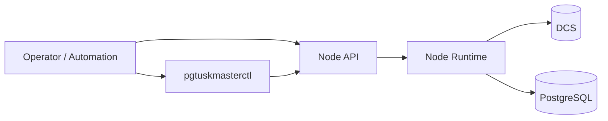

# Interfaces

This section describes the ways humans and automation interact with the node.

There are two primary interaction styles:
- “Control”: request an operation (for example, switchover)
- “Observe”: read current state (for example, HA state)

