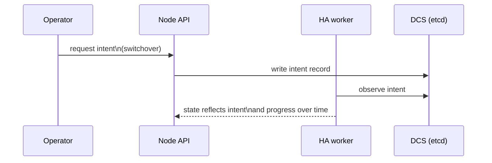

# Node API

The node API is the primary operator interface for HA control and state inspection.

The API is intentionally small: it is meant to express **intent**, not to expose internal mechanisms.

## High-level endpoints
- `GET /ha/state`: observe current HA-relevant state
- `POST /switchover`: request a planned primary transition
- `DELETE /ha/switchover`: cancel/clear a pending switchover request

## Optional debug endpoints

When `debug.enabled = true` in the runtime config, the node also serves debugging routes intended for development and incident triage (not the primary operator contract):

- `GET /debug/ui`: minimal debug UI
- `GET /debug/verbose?since=<sequence>`: structured “what changed” view
- `GET /debug/snapshot`: raw snapshot dump (kept for backwards compatibility)

## Authentication / authorization model
At a high level, the API distinguishes:
- read-only status access
- admin actions that mutate intent

Exact token fields and deployment policy are documented under Operations.
