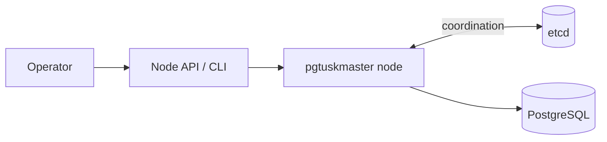

# Start Here

`pgtuskmaster` is a local HA controller for PostgreSQL. Each node supervises one PostgreSQL instance, keeps a watch on shared cluster state in etcd, and decides whether the local database should run as primary, replica, recovering follower, or in a conservative safety phase such as fail-safe or fencing.

The project is deliberately biased toward safe role changes. When the cluster view is healthy, the node can bootstrap, follow, promote, and handle planned switchover or unplanned failover. When trust in shared coordination drops, it slows down or refuses risky actions instead of guessing.

This book is intentionally split into two depth levels. The chapter landing pages and overview sections help you build a mental model quickly. The deeper pages underneath them explain the mechanics, safety boundaries, failure modes, and operator consequences in enough detail that you can read one chapter in isolation during an incident without losing the larger picture.

Use the chapter families like this:

- **Quick Start** proves that the checked-in container path works on your machine and teaches you what the first validation signals actually mean.
- **Operator Guide** explains how to configure, deploy, observe, and troubleshoot a running node once the lab path works.
- **System Lifecycle** explains why the node is in a given HA phase, which preconditions are being checked, and why some transitions are intentionally delayed or refused.
- **Architecture Assurance** turns the implementation into explicit safety arguments, assumptions, and limits so conservative behavior is easier to interpret correctly.
- **Interfaces** documents the concrete API and CLI contract surfaces without pretending that route shapes alone explain cluster behavior.
- **Contributors** is reserved for codebase internals and development workflow.

If you are brand new to the project, start with the Quick Start and then continue into the Operator Guide. If you are in the middle of an incident, jump directly to Operator Guide or System Lifecycle and expect some key context to be repeated there on purpose. If you need to decide whether a surprising behavior is protective or defective, read the Lifecycle and Assurance chapters together before you change configuration or force a transition.
