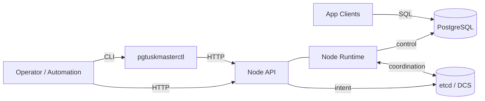

# Introduction

This book explains the **architecture and operational model** of `pgtuskmaster` (the Rust rewrite), aimed at engineers seeing this repository for the first time.

The priority is a clear mental model:
- What problems the system solves.
- What the major components are responsible for.
- How state changes propagate through the system.
- How failover, recovery, and safety are handled.
- How operators and automation interact with the system.

This book is intentionally *not* a code walkthrough. When we name internal concepts (for example, worker names or state names), it’s only to keep the architecture description faithful to the system you are running.

If you only remember three things after reading:
1. `pgtuskmaster` is a **control plane** that continuously reconciles desired cluster role (primary/replica) with what PostgreSQL is actually doing.
2. etcd is the **shared coordination memory** (who is leader, who is alive, what switchover is requested), but the system is explicitly designed to behave differently when DCS trust degrades.
3. “Safety” is a first-class design goal: when signals are inconsistent, the system prefers **fencing/demotion** over optimistic promotion.
