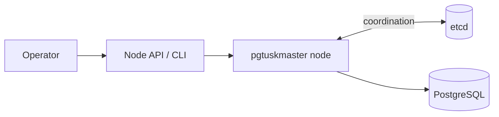

# Start Here

`pgtuskmaster` is a local HA controller for PostgreSQL. Each node supervises one PostgreSQL instance, keeps a watch on shared cluster state in etcd, and decides whether the local database should run as primary, replica, recovering follower, or in a conservative safety phase such as fail-safe or fencing.

The project is deliberately biased toward safe role changes. When the cluster view is healthy, the node can bootstrap, follow, promote, and handle planned switchover or unplanned failover. When trust in shared coordination drops, it slows down or refuses risky actions instead of guessing.

Read this book in the order that matches the job in front of you:

- Start with **Quick Start** if you need a first working node.
- Continue to **Operator Guide** for configuration, deployment, observability, and troubleshooting.
- Read **System Lifecycle** when you need to reason about startup, switchover, failover, recovery, or safety phases.
- Use **Interfaces** for the concrete API and CLI contract.
- Use **Contributors** only when you are changing the codebase itself.
