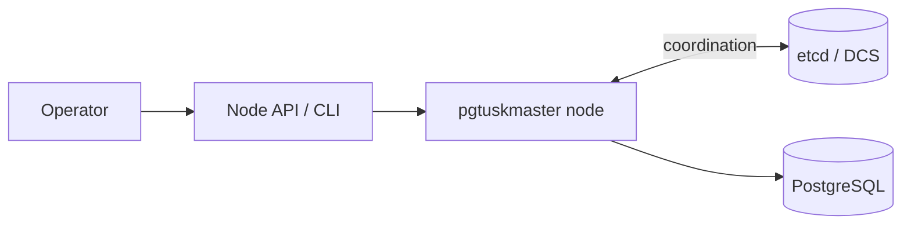

# Start Here

This system is a local high-availability control plane for PostgreSQL. One `pgtuskmaster` node supervises one PostgreSQL instance, participates in shared coordination through etcd, and continuously decides whether that PostgreSQL should run as primary, replica, or in a conservative safety state.

The practical goal is to keep role transitions safe and predictable. When a cluster is healthy, the system supports stable leadership, planned switchovers, and unplanned failover handling. When signals are inconsistent, the system prefers actions that reduce split-brain risk, even when those actions temporarily reduce write availability.

This documentation is organized to support two reading modes:

- If you are setting up or operating the system, start with **Quick Start** and then **Operator Guide**.
- If you need design confidence and lifecycle reasoning, continue with **System Lifecycle** and **Architecture Assurance**.
- If you are modifying the project, use **Contributors** for code structure, worker flow, and test internals.

The rest of this section answers three foundation questions in order:

1. What problem is this system meant to solve?
2. How does it solve that problem?
3. How should you navigate the rest of the book?
