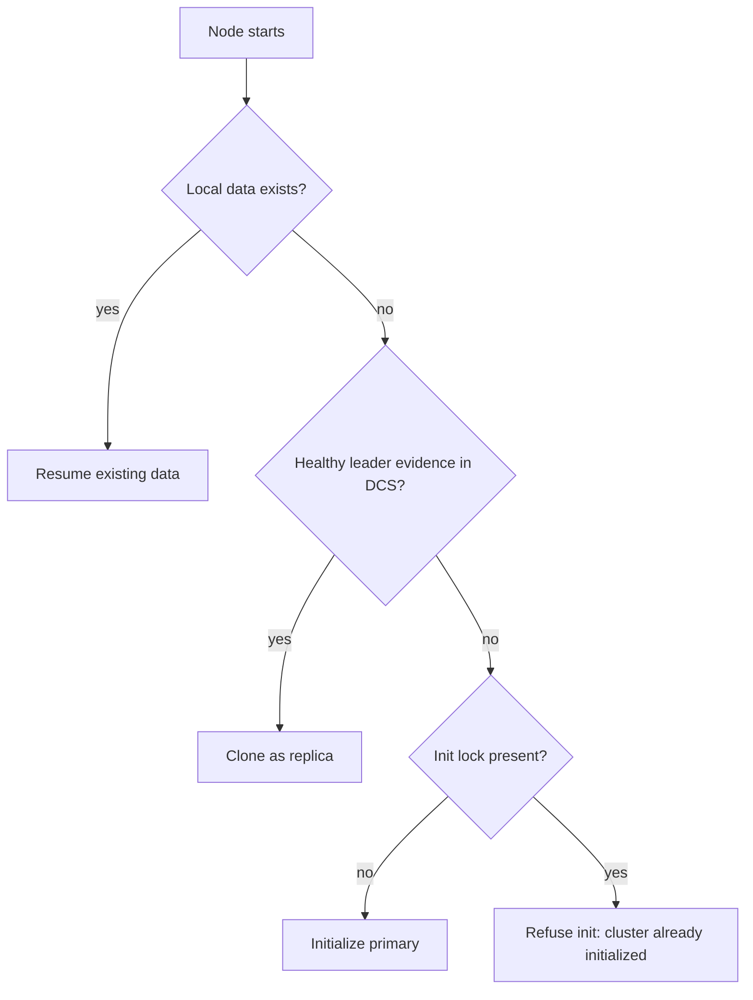

# Bootstrap and Startup Planning

At startup, the node chooses one safe initialization path before entering steady-state reconciliation.

The startup planner selects among:

- initializing a new primary
- cloning as a replica from a healthy source
- resuming existing local data

Replica cloning uses plain `pg_basebackup`. pgtuskmaster does not ask PostgreSQL tooling to write follow configuration on its behalf during clone. Before any managed start, it regenerates `PGDATA/pgtm.postgresql.conf`, rewrites the managed signal-file set, and quarantines any active `PGDATA/postgresql.auto.conf` so out-of-band local overrides cannot silently take precedence.

When startup resumes an existing data directory, DCS topology remains authoritative for role selection. Previously managed on-disk replica state is only consulted as a consistency signal; stale signal files or stale `postgresql.auto.conf` contents do not independently decide whether the node resumes as primary or replica.

## What operators should expect

Startup is intentionally restrictive because bad first choices create long-lived divergence:

- no usable data plus no initialized cluster evidence can lead to primary bootstrap
- no data plus healthy leader evidence can lead to replica clone
- existing data is resumed only after the planner checks whether the local state is coherent with current DCS evidence

The startup planner is single-pass. It does not sit in a long evidence-gathering loop before choosing a mode. That means existing local replica state without usable DCS authority becomes a hard startup error instead of an invitation to guess from leftover files.

## What usually blocks startup

If bootstrap repeatedly fails, check these first:

- wrong absolute paths in `process.binaries`
- directory ownership or permissions that prevent PostgreSQL startup
- replication authentication and `pg_hba` rules
- incorrect `[dcs].scope` or unreachable etcd endpoints
- leftover operator expectations based on `postgresql.auto.conf` or stale signal files

The last point matters because pgtuskmaster does not treat leftover PostgreSQL side effects as authoritative startup instructions.
