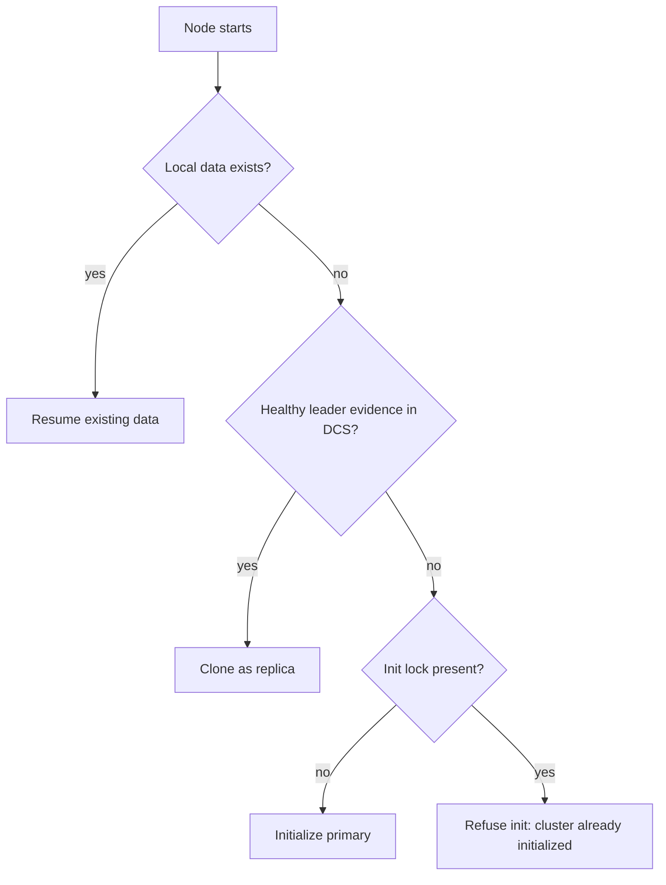

# Bootstrap and Startup Planning

At startup, the node chooses one safe initialization path before entering steady-state reconciliation.

The startup planner selects among:

- initializing a new primary
- cloning as a replica from a healthy source
- resuming existing local data

Replica cloning uses plain `pg_basebackup`. `pgtuskmaster` does not ask PostgreSQL tooling to write follow configuration on its behalf during clone. Before any managed start, it regenerates `PGDATA/pgtm.postgresql.conf`, rewrites the managed signal-file set, and quarantines any active `PGDATA/postgresql.auto.conf` so out-of-band local overrides cannot silently take precedence.

When startup resumes an existing data directory, DCS topology remains authoritative for role selection. Previously managed on-disk replica state is only consulted as a consistency signal; stale signal files or stale `postgresql.auto.conf` contents do not independently decide whether the node resumes as primary or replica.

## What operators should expect

Startup is intentionally restrictive because bad first choices create long-lived divergence:

- no usable data plus no initialized cluster evidence can lead to primary bootstrap
- no data plus healthy leader evidence can lead to replica clone
- existing data is resumed only after the planner checks whether the local state is coherent with current DCS evidence

The startup planner is single-pass. It does not sit in a long evidence-gathering loop before choosing a mode. That means existing local replica state without usable DCS authority becomes a hard startup error instead of an invitation to guess from leftover files.

## Startup chronology in practice

The runtime first validates configuration and logging, then inspects the PostgreSQL data directory and probes the DCS cache. That ordering matters. Data-dir state tells the node whether it is choosing among initialize, clone, or resume. The DCS probe tells it whether the cluster already has a visible leader, whether an init lock already exists, and which scope it should trust while making the first irreversible decision.

Only after those two views are combined does the planner pick a startup mode:

- **InitializePrimary** when there is no usable local data and no existing initialized-cluster claim blocks fresh bootstrap.
- **CloneReplica** when there is no usable local data but there is enough leader evidence to take a base backup from another member.
- **ResumeExisting** when local data already exists and can be brought back under managed control.

That mode choice drives the first startup actions: claim or seed the init lock when appropriate, run a base backup or bootstrap job when appropriate, then start PostgreSQL using regenerated managed configuration instead of trusting any leftover local side effects.

## Why existing data is treated carefully

Existing local data is helpful only when the runtime can explain what it is looking at. A data directory left over from a previous run might represent a healthy replica, a former primary, a partial bootstrap, or a broken manual experiment. If the node were to infer too much from the local files alone, it could restart into a role that conflicts with the current DCS picture.

The implementation therefore uses existing data as a candidate input, not as a free pass. DCS topology remains authoritative for role selection, and managed startup files are rebuilt to reflect the current intended role. This is why the docs keep repeating that stale `postgresql.auto.conf` contents or old signal files are not authoritative instructions.

## Decision paths and edge conditions

### Fresh cluster bootstrap

If there is no local data and no init lock blocking cluster creation, startup can choose the path that initializes a new primary. Operationally, this is the cleanest path because the node is not trying to reconcile with somebody else's history yet. The real caution is scope correctness: if the `[dcs].scope` is wrong, you may be proving bootstrap against an empty namespace that is not the cluster you intended to join.

### Clone from a visible leader

If there is no local data but the DCS probe shows a healthy leader source, startup can choose base-backup clone mode. This path is intentionally explicit. It is not "best effort follow whatever looks plausible". It requires enough evidence to identify a safe source and then performs managed startup work so the newly created replica follows the chosen leader under current configuration.

### Resume existing data

Resume is the path that most obviously benefits from conservative behavior. Existing data may be the fastest path back to service, but it is also the easiest path to get wrong if the node's old role no longer matches present cluster evidence. The runtime therefore keeps DCS topology authoritative and refuses to let stale local configuration silently outrank fresh coordination evidence.

### Refusal paths

Sometimes the safest startup decision is to refuse startup planning. Examples include an existing cluster init lock that conflicts with a would-be fresh bootstrap, an unreachable or incoherent DCS view when the local data requires coordination context, or path and permission problems that prevent managed PostgreSQL startup from even beginning. Those refusals are not pleasant, but they are safer than guessing into the wrong role and repairing divergence later.

## Operator-visible consequences

Startup mistakes usually become visible long before the cluster reaches steady state. You may see the node refuse to bootstrap, repeatedly fail managed start, or remain unable to explain a valid recovery source. Read those as planning failures first, not as steady-state HA failures. The startup planner is trying to answer "what is safe to start" before the normal reconcile loop can answer "what should I do next".

That distinction matters operationally:

- planning failures often point at config paths, auth wiring, scope mistakes, or missing leader evidence
- early waiting phases after a valid start point at ordinary HA loop convergence
- repeated reuse of stale local files without coherent DCS evidence points at a safety refusal, not at an invitation to override the runtime

## What usually blocks startup

If bootstrap repeatedly fails, check these first:

- wrong absolute paths in `process.binaries`
- directory ownership or permissions that prevent PostgreSQL startup
- replication authentication and `pg_hba` rules
- incorrect `[dcs].scope` or unreachable etcd endpoints
- leftover operator expectations based on `postgresql.auto.conf` or stale signal files

The last point matters because `pgtuskmaster` does not treat leftover PostgreSQL side effects as authoritative startup instructions.
