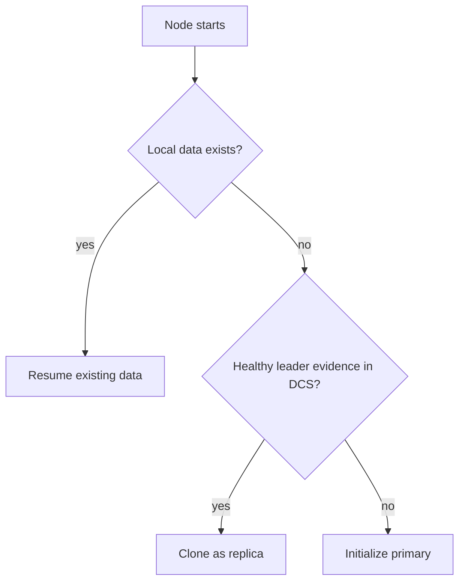

# Bootstrap and Startup Planning

At startup, the node chooses one safe initialization path before entering steady-state reconciliation.

The startup planner selects among:
- initializing a new primary
- cloning as a replica from a healthy source
- resuming existing local data

## Why this exists

Unsafe startup choices can create long-lived divergence. The planner exists to constrain first actions so the node begins from the least risky path available.

## Tradeoffs

Startup may pause to gather enough evidence before action. That can feel slower than immediate initialization, but it avoids unsafe assumptions about leader availability and data lineage.

## When this matters in operations

Startup symptoms often determine later failover quality. If bootstrap repeatedly fails, verify binary paths, directory permissions, replication auth, and DCS scope consistency before forcing manual role assumptions.
